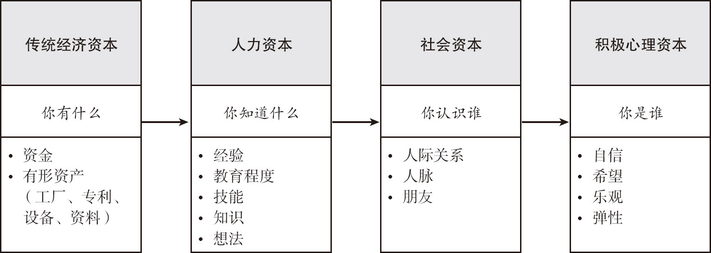
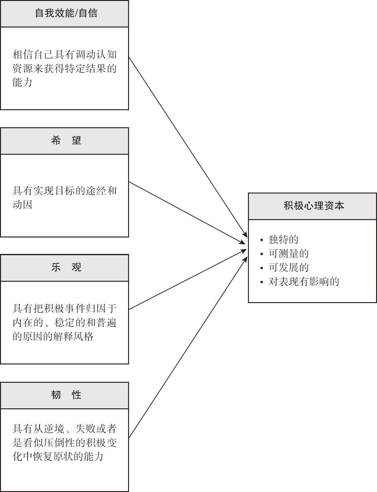
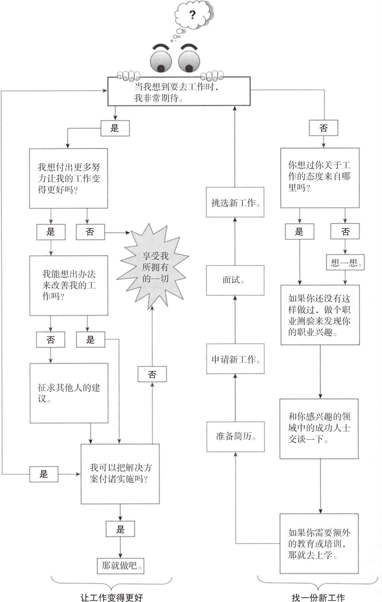

# 1111-11-24-积极心理学导论-笔记

## 目录

-   [《积极心理学-探索人类优势的科学与实践》读书笔记](#积极心理学-探索人类优势的科学与实践读书笔记)
    -   [推荐序](#推荐序)
    -   [前言](#前言)
    -   [ch01-从积极视角审视心理学](#ch01-从积极视角审视心理学)
    -   [ch05-在文化背景下发展优势和幸福生活](#ch05-在文化背景下发展优势和幸福生活)
    -   [ch06 在人生的每个阶段都幸福生活](#ch06-在人生的每个阶段都幸福生活)
    -   [ch07-快乐的原理](#ch07-快乐的原理)
        -   [情绪术语的界定](#情绪术语的界定)
        -   [情感](#情感)
        -   [情绪](#情绪)
        -   [幸福](#幸福)
        -   [主观幸福感](#主观幸福感)
        -   [区分积极和消极](#区分积极和消极)
        -   [积极情绪:不仅仅是快乐](#积极情绪不仅仅是快乐)
    -   [个人小实验：追求快乐和持久的幸福](#个人小实验追求快乐和持久的幸福)
    -   [幸福和主观幸福感:快乐生活](#幸福和主观幸福感快乐生活)
        -   [幸福的古老定义](#幸福的古老定义)
        -   [主观幸福感:幸福的同义词](#主观幸福感幸福的同义词)
    -   [生活满意度量表](#生活满意度量表)
        -   [主观幸福感的决定因素](#主观幸福感的决定因素)
        -   [幸福+意义=幸福感](#幸福意义幸福感)
        -   [21世纪的幸福定义](#21世纪的幸福定义)
        -   [完全的心理健康:情绪的、社会的和心理的幸福感](#完全的心理健康情绪的社会的和心理的幸福感)
        -   [在你的生活中提升幸福感](#在你的生活中提升幸福感)
        -   [走向积极](#走向积极)
    -   [生活提升策略](#生活提升策略)
    -   [ch08 有效利用情绪体验](#ch08-有效利用情绪体验)
        -   [情绪焦点应对:发现情绪趋近的适应性潜能](#情绪焦点应对发现情绪趋近的适应性潜能)
            -   [情绪加工](#情绪加工)
            -   [情绪表达](#情绪表达)
        -   [飓风幸存者的案例](#飓风幸存者的案例)
        -   [情绪智力:学习重要的技能](#情绪智力学习重要的技能)
        -   [玛丽亚的案例](#玛丽亚的案例)
        -   [社会情绪选择:在晚年关注积极情绪和情绪相关目标](#社会情绪选择在晚年关注积极情绪和情绪相关目标)
        -   [情绪故事讲述:彭尼贝克范式可作为一种加工强烈消极情绪的方法](#情绪故事讲述彭尼贝克范式可作为一种加工强烈消极情绪的方法)
        -   [与情绪共处以带来积极改变](#与情绪共处以带来积极改变)
        -   [情绪均衡行为](#情绪均衡行为)
    -   [个人小实验：在日常生活中有效利用情绪](#个人小实验在日常生活中有效利用情绪)
    -   [生活提升策略](#生活提升策略)
-   [ch09-通过自我效能-乐观和希望看待我们的未来](#ch09-通过自我效能-乐观和希望看待我们的未来)
    -   [对未来着迷](#对未来着迷)
    -   [第12节](#第12节)
-   [ch10-智慧和勇气](#ch10-智慧和勇气)
    -   [智慧和勇气：同类的两个美德](#智慧和勇气同类的两个美德)
    -   [智慧理论](#智慧理论)
    -   [智慧的内隐理论](#智慧的内隐理论)
    -   [智慧的外显理论](#智慧的外显理论)
    -   [获得智慧并保持智慧](#获得智慧并保持智慧)
        -   [发展智慧](#发展智慧)
        -   [有智慧的人及其特征](#有智慧的人及其特征)
        -   [智慧的测量](#智慧的测量)
        -   [智慧和智力之间的关系](#智慧和智力之间的关系)
    -   [勇气理论](#勇气理论)
        -   [勇气的内隐理论](#勇气的内隐理论)
        -   [获得勇气并保持勇气](#获得勇气并保持勇气)
    -   [勇气研究](#勇气研究)
        -   [勇气的测量](#勇气的测量)
        -   [恐惧和勇气之间的关系](#恐惧和勇气之间的关系)
        -   [在日常生活中发现智慧和勇气](#在日常生活中发现智慧和勇气)
        -   [智慧和勇气的价值](#智慧和勇气的价值)
    -   [个人小实验：在普通人中寻找智慧和勇气……包括你自己](#个人小实验在普通人中寻找智慧和勇气包括你自己)
    -   [生活提升策略](#生活提升策略)
        -   [爱](#爱)
        -   [工作](#工作)
        -   [游戏](#游戏)
    -   [ch11-专念-流畅感和精神感悟](#ch11-专念-流畅感和精神感悟)
        -   [实时寻求](#实时寻求)
        -   [专念：寻找新奇](#专念寻找新奇)
        -   [专念作为一种心理状态](#专念作为一种心理状态)
    -   [我们接下来尽最大努力详细说明兰格（2002）的专念（mindfulness）定义，并描述练习专念冥想的好处。](#我们接下来尽最大努力详细说明兰格2002的专念mindfulness定义并描述练习专念冥想的好处)
    -   [表11.1 专念品质](#表111-专念品质)
        -   [专念的益处](#专念的益处)
        -   [专念生活](#专念生活)
    -   [个体可以增加对任何活动的觉知。这里有一些例子。](#个体可以增加对任何活动的觉知这里有一些例子)
        -   [专念于情绪](#专念于情绪)
        -   [专念于饮食](#专念于饮食)
        -   [专念于做伸展练习](#专念于做伸展练习)
        -   [专念于呼吸和静坐――冥想](#专念于呼吸和静坐冥想)
    -   [在这一章，我们讨论专念、流畅感和精神感悟。我们的总结提示，有意寻求新奇、全神贯注和神圣，可以助你走向更好的生活。](#在这一章我们讨论专念流畅感和精神感悟我们的总结提示有意寻求新奇全神贯注和神圣可以助你走向更好的生活)
    -   [个人小实验：寻求最佳体验](#个人小实验寻求最佳体验)
        -   [寻求新奇：在你的关系中增加专念。](#寻求新奇在你的关系中增加专念)
        -   [寻求全神贯注：在你的上课日中找到流畅感。](#寻求全神贯注在你的上课日中找到流畅感)
        -   [寻求神圣：在日常生活中更注重精神感悟。](#寻求神圣在日常生活中更注重精神感悟)
        -   [流畅感：寻求全神贯注](#流畅感寻求全神贯注)
        -   [流畅感状态](#流畅感状态)
        -   [自带目的性人格](#自带目的性人格)
        -   [纵向流畅感研究](#纵向流畅感研究)
        -   [培养流畅感及其益处](#培养流畅感及其益处)
    -   [生活提升策略](#生活提升策略)
        -   [爱](#爱)
        -   [工作](#工作)
        -   [游戏](#游戏)
        -   [精神感悟:寻求神圣](#精神感悟寻求神圣)
        -   [精神感悟的真正益处](#精神感悟的真正益处)
        -   [寻求仍在继续](#寻求仍在继续)
    -   [练习专念、流畅感和精神感悟对你的身心健康、学业或工作表现、社会幸福感都有好处。这些练习可能对我们产生更深远的影响。事实上,这些寻求可能让我们获得充满意义的、更深入的存在感。](#练习专念流畅感和精神感悟对你的身心健康学业或工作表现社会幸福感都有好处这些练习可能对我们产生更深远的影响事实上这些寻求可能让我们获得充满意义的更深入的存在感)
-   [ch12-同理心和利己](#ch12-同理心和利己)
    -   [本章中，我们会探索同理心和利己如何导致利他、感恩和宽恕](#本章中我们会探索同理心和利己如何导致利他感恩和宽恕)
    -   [我们先定义一下利他。接下来，我们探讨利己（或自尊）动机，以及它如何驱动各种利他行为。然后，我们讨论同理心利他假说，并探讨同理心的遗传和神经基础。最后，我们讨论增强和测量利他的各种方法。](#我们先定义一下利他接下来我们探讨利己或自尊动机以及它如何驱动各种利他行为然后我们讨论同理心利他假说并探讨同理心的遗传和神经基础最后我们讨论增强和测量利他的各种方法)
        -   [利他的定义](#利他的定义)
        -   [利己动机](#利己动机)
        -   [利己引发的利他形式](#利己引发的利他形式)
        -   [同理心动机和同理心利他假说](#同理心动机和同理心利他假说)
        -   [同理心的遗传基础和神经机制](#同理心的遗传基础和神经机制)
    -   [如何培养利他](#如何培养利他)
        -   [基于利己来增强利他行为的方法](#基于利己来增强利他行为的方法)
        -   [基于同理心来增强利他行为的方法](#基于同理心来增强利他行为的方法)
    -   [个人小实验：练习利他、感恩和宽恕](#个人小实验练习利他感恩和宽恕)
        -   [利他的测量](#利他的测量)
    -   [在下面的部分中，我们将讨论感恩的概念。在20多年前，感恩很少受到研究者的注意。我们首先定义感恩，然后讨论应该如何培养和测量它，总结它的生理基础，最后以一个真实的生活例子结束。](#在下面的部分中我们将讨论感恩的概念在20多年前感恩很少受到研究者的注意我们首先定义感恩然后讨论应该如何培养和测量它总结它的生理基础最后以一个真实的生活例子结束)
        -   [感恩的定义](#感恩的定义)
        -   [培养感恩](#培养感恩)
        -   [测量感恩](#测量感恩)
        -   [感恩的心理生理学基础](#感恩的心理生理学基础)
        -   [感恩：一次家庭维修](#感恩一次家庭维修)
    -   [宽恕。在这一部分，我们首先介绍关于宽恕的各种不同定义，然后描述如何培养宽恕，总结它的测量方法，以对宽恕的进化和神经生理学基础的概述结束。](#宽恕在这一部分我们首先介绍关于宽恕的各种不同定义然后描述如何培养宽恕总结它的测量方法以对宽恕的进化和神经生理学基础的概述结束)
        -   [宽恕的定义](#宽恕的定义)
        -   [宽恕（forgiveness）是指受害者从对侵犯源的负性情感联结中解脱出来。](#宽恕forgiveness是指受害者从对侵犯源的负性情感联结中解脱出来)
        -   [宽恕反映了对另一个人的亲社会性动机的增强，以至于](#宽恕反映了对另一个人的亲社会性动机的增强以至于)
        -   [宽恕定义为“受害者受到他人的伤害后，自愿地放弃怨恨侵犯者、对侵犯者进行负性判断和采取冷漠行为的权利，而是培养对他或她的同情、宽大甚至关爱”](#宽恕定义为受害者受到他人的伤害后自愿地放弃怨恨侵犯者对侵犯者进行负性判断和采取冷漠行为的权利而是培养对他或她的同情宽大甚至关爱)
        -   [宽恕体现了以下几点：](#宽恕体现了以下几点)
    -   [培养宽恕。在这一部分，我们探究如何学会宽恕。相应地，我们的宽恕指导针对三个侵犯源：他人、自己以及一个情境或事件。](#培养宽恕在这一部分我们探究如何学会宽恕相应地我们的宽恕指导针对三个侵犯源他人自己以及一个情境或事件)
        -   [宽恕他人](#宽恕他人)
        -   [宽恕自己](#宽恕自己)
        -   [宽恕一个情境](#宽恕一个情境)
        -   [测量宽恕](#测量宽恕)
        -   [宽恕的进化和神经生理学基础](#宽恕的进化和神经生理学基础)
    -   [利他、感恩和宽恕的社会性意义。在本部分，我们探讨利他、感恩和宽恕的社会反响。你将从中了解到，这三个过程对于帮助群体中的人们更稳定、更和谐地生活在一起有着非常关键的作用。](#利他感恩和宽恕的社会性意义在本部分我们探讨利他感恩和宽恕的社会反响你将从中了解到这三个过程对于帮助群体中的人们更稳定更和谐地生活在一起有着非常关键的作用)
        -   [同理心/利己和利他](#同理心利己和利他)
        -   [同理心/利己和感恩](#同理心利己和感恩)
        -   [同理心/利己和宽恕](#同理心利己和宽恕)
        -   [道德责任：利他、感恩和宽恕](#道德责任利他感恩和宽恕)
        -   [“我有一个梦想”：更善良、更温和的人类](#我有一个梦想更善良更温和的人类)
    -   [生活提升策略](#生活提升策略)
        -   [爱](#爱)
        -   [工作](#工作)
        -   [游戏](#游戏)
        -   [本章附录：4个测量表](#本章附录4个测量表)
-   [ch13-依恋、爱和丰盛的关系](#ch13-依恋爱和丰盛的关系)
    -   [在本章中,我们论述如下内容:](#在本章中我们论述如下内容)
        -   [婴儿依恋](#婴儿依恋)
    -   [个人小实验：追寻爱和丰盛的关系](#个人小实验追寻爱和丰盛的关系)
        -   [依恋的攀爬架观察](#依恋的攀爬架观察)
        -   [两个圆的关系（确定爱作为你生活中自我扩展力量的程度）](#两个圆的关系确定爱作为你生活中自我扩展力量的程度)
        -   [有效利用好消息](#有效利用好消息)
        -   [成人依恋的安全性](#成人依恋的安全性)
        -   [爱](#爱)
    -   [我们将描述浪漫爱情的三种定义,这可能会加深你对两人之间如何形成爱情的理解。](#我们将描述浪漫爱情的三种定义这可能会加深你对两人之间如何形成爱情的理解)
        -   [浪漫爱情中的激情之爱和伴侣之爱](#浪漫爱情中的激情之爱和伴侣之爱)
        -   [爱情三元理论](#爱情三元理论)
        -   [浪漫爱情的自我扩展理论](#浪漫爱情的自我扩展理论)
        -   [对爱情研究的评论](#对爱情研究的评论)
    -   [接下来的部分不再强调积极情绪,转向讨论让大多数亲密关系成功的行为。](#接下来的部分不再强调积极情绪转向讨论让大多数亲密关系成功的行为)
    -   [生活提升策略](#生活提升策略)
        -   [丰盛的关系:一系列目的性积极关系行为](#丰盛的关系一系列目的性积极关系行为)
            -   [建立专注的情感联结。专念模型的五成分模型](#建立专注的情感联结专念模型的五成分模型)
            -   [创造一种相互欣赏的氛围](#创造一种相互欣赏的氛围)
            -   [利用积极事件。你的朋友/亲属/伴侣对好消息的习惯性反应是什么？](#利用积极事件你的朋友亲属伴侣对好消息的习惯性反应是什么)
        -   [人际联结的神经生物学基础](#人际联结的神经生物学基础)
        -   [关于丰盛关系的更多内容](#关于丰盛关系的更多内容)
        -   [建立亲密关系的积极心理学](#建立亲密关系的积极心理学)
    -   [ch14 心理健康和行为的均衡概念建构](#ch14-心理健康和行为的均衡概念建构)
-   [在这一章，我们探讨](#在这一章我们探讨)
    -   [均衡的概念建构](#均衡的概念建构)
    -   [我们对异常行为的着迷](#我们对异常行为的着迷)
    -   [忽视环境和积极方面](#忽视环境和积极方面)
    -   [提出问题：四面法](#提出问题四面法)
    -   [麦克尔的例子](#麦克尔的例子)
    -   [缺乏对发展的重视](#缺乏对发展的重视)
    -   [使消极和积极行为标准化](#使消极和积极行为标准化)
    -   [在文化背景下理解行为的困难](#在文化背景下理解行为的困难)
    -   [确定为何要作“文化考量”](#确定为何要作文化考量)
    -   [麦克尔的例子](#麦克尔的例子)
    -   [分类诊断系统的局限](#分类诊断系统的局限)
    -   [考虑新的人格维度](#考虑新的人格维度)
    -   [麦克尔的例子](#麦克尔的例子)
    -   [跳出DSM-IV框架](#跳出DSM-IV框架)
    -   [注意所有行为](#注意所有行为)
    -   [ch15 干预以预防坏事和提升好事](#ch15-干预以预防坏事和提升好事)
        -   [一级预防](#一级预防)
        -   [针对成年人的二级预防方案](#针对成年人的二级预防方案)
        -   [一级提升：“让生活美好”](#一级提升让生活美好)
        -   [一级提升：心理健康](#一级提升心理健康)
        -   [一级提升：身体健康](#一级提升身体健康)
            -   [一级提升的局限](#一级提升的局限)
        -   [二级提升：“让生活尽可能最好”](#二级提升让生活尽可能最好)
            -   [二级提升：心理健康](#二级提升心理健康)
            -   [个人小实验](#个人小实验)
            -   [二级提升：身体健康](#二级提升身体健康)
            -   [二级提升的局限](#二级提升的局限)
            -   [预防和提升系统的平衡](#预防和提升系统的平衡)
    -   [ch16 积极的学校教育](#ch16-积极的学校教育)
    -   [ch17 好的工作](#ch17-好的工作)
        -   [收益性受雇](#收益性受雇)
        -   [珍妮故事中的关键信息](#珍妮故事中的关键信息)
        -   [收益性受雇：幸福、满意和其他](#收益性受雇幸福满意和其他)
        -   [表现好和实现目标](#表现好和实现目标)
        -   [提供产品和服务所带来的目的感](#提供产品和服务所带来的目的感)
        -   [投入和参与](#投入和参与)
        -   [工作职责的多样性](#工作职责的多样性)
        -   [可为家庭和个人带来收入](#可为家庭和个人带来收入)
        -   [对同事、老板的友谊和忠诚：工作中的朋友](#对同事老板的友谊和忠诚工作中的朋友)
        -   [安全的工作环境](#安全的工作环境)
    -   [总而言之，好消息是，工作中有一些因素尤其能带来更大的幸福感和满足感，而且通常有助于收益性受雇。同样重要的是，工作中的不幸福并非不可避免，本章剩余内容会讨论此主题。](#总而言之好消息是工作中有一些因素尤其能带来更大的幸福感和满足感而且通常有助于收益性受雇同样重要的是工作中的不幸福并非不可避免本章剩余内容会讨论此主题)
        -   [收益性受雇的测量](#收益性受雇的测量)
    -   [本部分,我们将介绍自己编制的工具,帮助人们具体地认识他们对工作的看法。这种方法允许人们对收益性受雇的八种特征进行重要性等级评定,评估自己在每个类别上做得如何,并得出工作总分。现在我们就来说明该工具以及如何使用它,然后给出两个来访者在实际中使用此法的例子](#本部分我们将介绍自己编制的工具帮助人们具体地认识他们对工作的看法这种方法允许人们对收益性受雇的八种特征进行重要性等级评定评估自己在每个类别上做得如何并得出工作总分现在我们就来说明该工具以及如何使用它然后给出两个来访者在实际中使用此法的例子)
        -   [你的工作](#你的工作)
        -   [回到珍妮的例子上](#回到珍妮的例子上)
        -   [没有得到终身教职的助理教授](#没有得到终身教职的助理教授)
        -   [有一个或做一个好老板](#有一个或做一个好老板)
        -   [工作中采用优势取向的方法](#工作中采用优势取向的方法)
    -   [本部分,我们描述一个匹配员工职责与其优势和才干的全新方法。我们先讨论这种趋势的各个方面,然后探究采用优势取向的方法。](#本部分我们描述一个匹配员工职责与其优势和才干的全新方法我们先讨论这种趋势的各个方面然后探究采用优势取向的方法)
        -   [把人和工作匹配起来,不要修补他们](#把人和工作匹配起来不要修补他们)
        -   [本方法的阶段](#本方法的阶段)
        -   [它有效吗？](#它有效吗)
        -   [资产练习](#资产练习)
        -   [工作中的资本](#工作中的资本)
    -   [在接下来的部分中,我们分享其见解的演化及其发展。](#在接下来的部分中我们分享其见解的演化及其发展)
    -   [下一部分我们详细探究心理资本的其中一个形式——希望。](#下一部分我们详细探究心理资本的其中一个形式希望)
        -   [希望:首要的心理资本](#希望首要的心理资本)
    -   [高希望的公司具有非常相似的特征。我们接下来讨论高希望公司的特征。](#高希望的公司具有非常相似的特征我们接下来讨论高希望公司的特征)
        -   [高希望的公司具有以下共同特征:](#高希望的公司具有以下共同特征)
        -   [高希望的员工具有以下共同特征:](#高希望的员工具有以下共同特征)
        -   [在工作中运用各种希望](#在工作中运用各种希望)
        -   [可以增加工作中的希望吗？](#可以增加工作中的希望吗)
        -   [黑暗面:工作狂、职业倦怠和失业](#黑暗面工作狂职业倦怠和失业)
    -   [本部分,我们总结那些可能最需要积极心理学带来好处的工作者:所有时间都在工作的人,那些出现职业倦怠的人,以及失业的人。](#本部分我们总结那些可能最需要积极心理学带来好处的工作者所有时间都在工作的人那些出现职业倦怠的人以及失业的人)
        -   [工作狂](#工作狂)
        -   [职业倦怠](#职业倦怠)
        -   [失业](#失业)
        -   [如何改善你的工作](#如何改善你的工作)
        -   [让工作变得更好](#让工作变得更好)
        -   [申请一份新工作](#申请一份新工作)
    -   [个人小实验：让你的工作成为收益性职业](#个人小实验让你的工作成为收益性职业)
        -   [你可以在家工作吗？](#你可以在家工作吗)
        -   [当考虑工作态度时,你是个“酷似父母的人”吗？](#当考虑工作态度时你是个酷似父母的人吗)
        -   [你从哪获得你的职业兴趣？](#你从哪获得你的职业兴趣)
        -   [当工作变成一种使命:一个医院勤杂工的故事](#当工作变成一种使命一个医院勤杂工的故事)
        -   [一种新的核算方法:关注人而不是金钱](#一种新的核算方法关注人而不是金钱)
-   [ch18-平衡我与我们](#ch18-平衡我与我们)
    -   [在本章,我们将用人类的两大重要动机作为框架。第一个动机是以个人主义为中心的,即个人追求一种相比于他人的特殊感。第二个动机是以集体主义为中心的,即个人致力于与他人进行最大程度的关联](#在本章我们将用人类的两大重要动机作为框架第一个动机是以个人主义为中心的即个人追求一种相比于他人的特殊感第二个动机是以集体主义为中心的即个人致力于与他人进行最大程度的关联)
    -   [ch19 走向积极](#ch19-走向积极)

***

《积极心理学导论》

-   [ch01-从积极视角审视心理学](#ch01-从积极视角审视心理学 "ch01-从积极视角审视心理学")
-   [ch05-在文化背景下发展优势和幸福生活](#ch05-在文化背景下发展优势和幸福生活 "ch05-在文化背景下发展优势和幸福生活")
-   [ch06-在人生的每个阶段都幸福生活](#ch06-在人生的每个阶段都幸福生活 "ch06-在人生的每个阶段都幸福生活")
-   [ch07-快乐的原理](#ch07-快乐的原理 "ch07-快乐的原理")
-   [ch08-有效利用情绪体验](#ch08-有效利用情绪体验 "ch08-有效利用情绪体验")
-   [ch09-通过自我效能、乐观和希望看待我们的未来](#ch09-通过自我效能-乐观和希望看待我们的未来 "ch09-通过自我效能、乐观和希望看待我们的未来")
-   [ch10-智慧和勇气](#ch10-智慧和勇气 "ch10-智慧和勇气")
-   [ch11-专念、流畅感和精神感悟](#ch11-专念-流畅感和精神感悟 "ch11-专念、流畅感和精神感悟")
-   [ch12-同理心和利己](#ch12-同理心和利己 "ch12-同理心和利己")
-   [ch13-依恋、爱和丰盛的关系](#ch13-依恋、爱和丰盛的关系 "ch13-依恋、爱和丰盛的关系")
-   [ch14-心理健康和行为的均衡概念建构](#ch14-心理健康和行为的均衡概念建构 "ch14-心理健康和行为的均衡概念建构")
-   [ch15-干预以预防坏事和提升好事](#ch15-干预以预防坏事和提升好事 "ch15-干预以预防坏事和提升好事")
-   [ch16-积极的学校教育](#ch16-积极的学校教育 "ch16-积极的学校教育")
-   [ch17-好的工作](#ch17-好的工作 "ch17-好的工作")
-   [ch18-平衡“我”与“我们”](#ch18-平衡我与我们 "ch18-平衡“我”与“我们”")
-   [ch19-走向积极](#ch19-走向积极 "ch19-走向积极")

# 《积极心理学-探索人类优势的科学与实践》读书笔记

## 推荐序

积极心理学是由一群杰出的心理学家在1998年创立的，他们的代表人物是宾夕法尼亚大学心理学教授马丁•塞利格曼，他把日常生活中的“幸福”概念，转变成一门结论可靠、方法严谨的科学概念。塞利格曼在担任美国心理学会主席后，更是全力推动积极心理学运动。积极心理学比“幸福学”的含义更广泛。它研究人的所有积极心态，比如积极情绪、优秀品格、道德美德、幸福组织、创新卓越等人类美好的心理活动。它教人如何愉快生活，如何做一个善良、有道德、有理性的人。积极心理学倡导人首先要正心，这是做任何事最重要的核心。塞利格曼在他的新书《持续的幸福》里提出“全面幸福”，来替代通常所说的“感觉幸福”。他把幸福定义为五个因素：正面情绪、身心投入、良好关系、人生意义和生活成就，而品格优势则是它们的共同基础。

## 前言

1.  第一编，“从积极视角审视心理学”包括4章。

-   第1章（“欢迎学习积极心理学”）向你介绍该领域。
-   第2章和第3章探索了该领域的东西方文化背景。接下来，我们在
-   第4章（“人类优势和积极结果的分类与测量”）解释了对该领域内各主题进行归类的尝试。

1.  第二编，“不同背景下的积极心理学”，我们讨论了情绪在积极生活中的作用。

-   第5章（“在文化背景下发展优势和幸福生活”），我们考察文化因素在决定何为积极中所起的作用。
-   第6章（“在人生的每个阶段都幸福生活”），我们追踪人类优势的发展。

1.  第三编，“积极情绪状态和过程”，共2章。

-   第7章（“快乐的原理：理解积极情感、积极情绪、幸福和幸福感”），我们展示来自情绪和幸福研究的发现。
-   第8章（“有效利用情绪体验：情绪应对、情绪智力、社会情绪选择和情绪故事讲述”），揭示了关于情绪如何对生活中的有效应对做出积极贡献的最新发现。

1.  第四编，“积极认知状态和过程”，包含3章。

-   第9章（“通过自我效能、乐观和希望看待我们的未来”），涵盖最强大的积极认知和动机状态。
-   在第10章（“智慧和勇气：两种普遍的美德”）中，我们介绍了人们如何在困难的环境中发挥出最佳水平。
-   在第11章（“专念、流畅感和精神感悟：寻求最佳体验”）中，我们详细介绍了最新的研究发现，这些研究涉及与自我和高级力量有关的心理过程的作用。

1.  第五编，“亲社会行为”。在这一部分，我们主要探讨人际问题。在第12章（“同理心和利己：利他、感恩和宽恕之门”）和第13章（“依恋、爱和丰盛的关系”）中，我们展示人际关系如何提高生活质量。
2.  第六编，“理解和改变人类行为”，将提供如何改善生活的深刻见解，主要包括

-   第14章（“心理健康和行为的均衡概念建构”）和
-   第15章（“干预以预防坏事和提升好事”）。

1.  第七编，“积极环境”，我们描述了如何促进更有成效的、更幸福的生活。包括

-   学校（第16章“积极的学校教育”）、
-   工作（第17章“好的工作：收益性受雇的心理学”）和
-   社区（第18章“平衡‘我’与‘我们’：建设更好的社区”）

1.  最后，第八编，“从积极视角展望心理学的未来”，我们提供了关于积极心理学未来发展方向的概览（第19章“走向积极”）。

## ch01-从积极视角审视心理学

人类拥有的某些优势最有可能抵御心理疾病：勇气、乐观、人际技能、职业道德、希望、诚实和毅力。

在这一章，我们首先介绍在日常生活和心理学研究中关注积极方面的潜在益处。

-   第一部分我们要讲述一个报载积极故事，以阐明世界之美好，以及这类故事给读者带来的积极影响。
-   第二部分我们要讨论兼顾人类的优势和弱点这一均衡视角的重要性。我们提醒读者不要卷入优势和弱点孰优孰劣的争论，不要纠结于哪一方更好地反映了“事实”。
-   第三部分我们要探讨迄今为止心理学关注的人类优势。
-   第四部分我们要让读者感受自己典型的情绪反应，并讨论情绪对认知世界的影响。我们还将分享我们的一个星期六，作为积极心理学特有的思维和情感例子。
-   在接下来的第五部分，我们带你浏览本书的八个主要部分，提供每章内容的简要预览。
-   最后我们提出，积极心理学代表21世纪美国潜在的“黄金时代”。

最后，我们还想强调写作这本书的另外两个要点

1.  对于不同的主题，都要呈现我们认为最好的研究。但是，我们在书中**只介绍不同研究者的理论和发现，而不会深入详尽地阐述他们的方法**。我们之所以采用这一“广度大于深度”的取向，原因是这是一本导论性的著作；不过，积极心理学取得各种发现的方法，代表了心理学领域中最精细、最复杂的设计和统计。
2.  尽管我们没用单独的章节来介绍作为积极心理学基础的生理学和神经生物学（偶尔会提到演化），但我们依然认为这些视角非常重要。因此，在每一章的特定主题背景下，我们会讨论生理学、神经生物学和演化因素。例如，在自我效能、乐观和希望一章，我们讨论了神经生物学基础。类似地，在感恩一章，我们探讨了基本的心电和脑电模式。并且，在讨论宽恕时，我们会谈及这一反应的进化优势。

第2章和第3章的标题分别是“积极心理学的西方视角”和“积极心理学的东方视角”。在这两章，你将会看到，尽管积极心理学明显与西方文化有关，但是也有一些重要的主题来自东方文化。第4章，“人类优势和积极结果的分类与测量”，你将会了解心理学家如何将标签赋予不同类型的人类优点。对于熟悉传统病理学模型的读者而言，它们为你们提供了基于人类优势的相反的分类。

## ch05-在文化背景下发展优势和幸福生活

本章，我们将阐述：

-   （1）心理学家有关文化对积极和消极行为作用的历史立场，
-   （2）积极心理学家如何将文化观点整合到他们的研究之中，以及
-   （3）我们将来对优势与积极功能的研究中文化影响的作用。

## ch06 在人生的每个阶段都幸福生活

健康发展的标志是获得下列9个积极结果中的一些（Catalano，Berglund，Lonczak＆Hawkins，1998），即积极方案的目标。（本书的其他地方提出了所有这些积极结果。）

-   带来收益的联结
-   提升社会、情绪、认知、行为和道德能力
-   鼓励自我决定
-   培养精神感悟
-   培育一个清晰和积极的同一性
-   建立对将来的信念
-   认识到积极的行为
-   为亲社会发展提供机会
-   建立亲社会的规范

## ch07-快乐的原理

我们会报告我们目前所知道的如何让生活更快乐的知识。我们也会总结一些区分积极情感和消极情感的研究。同样,我们注重积极情绪,以及由积极情绪所带来的更多益处。我们会探讨幸福和幸福感的多种定义,以及快乐生活的品质。在此之前,我们要界定一些在本章中会频繁使用到的术语和概念

### 情绪术语的界定

把情感理解为情绪的一种成分,而情绪是心境的一种更具体的说法。

### 情感

情感(affect)是一个人对刺激的即刻的生理反应,有一定的唤醒度。

### 情绪

情绪涉及对重要事件的判断,判断一个外部客体是否对我们自己的幸福感很重要,在我们不能完全控制的世界面前,承认自己的贫乏与不足

### 幸福

幸福(happiness)是一种个体主观界定的积极情绪状态。

### 主观幸福感

主观幸福感涉及个体对当前状况的主观评价。

### 区分积极和消极

消极和积极情感呈负相关,但是这种相关相当弱,表明这两类情感是彼此独立的。

### 积极情绪:不仅仅是快乐

当体验到适度的积极情绪时,我们更可能:(1)帮助其他人(Isen,1987);(2)思维更具有灵活性(Ashby,Isen\&Turken,1999);(3)想出问题的解决办法

***

## 个人小实验：追求快乐和持久的幸福

1.  卡通片/喜剧前测/后测:根据你此刻的感受填写PANAS量表,然后看一段(5\~20分钟,如果可能的话,中间不要有广告)你最喜欢的表现善言幽默的卡通片或情景喜剧(不是冷嘲热讽的喜剧)。看完之后,立即再次填写PANAS。留意你的积极情感和消极情感发生的改变。
2.  “看完电影后,想到什么？”实验:这个实验需要认真选择两部电影:一部是悲剧题材,残忍的结局(“感觉不好”的电影);另一部电影强调开心和成功(“感觉好”的电影)。邀请同一组朋友在家或在电影院,分别在两个时间段观看这两部片子。看完电影后,问你的朋友:“如果你现在能做任何事,你会做什么？还有别的吗？”记录下你的朋友提到了多少活动,以及他讨论这些活动的热情。区别在感觉好的电影和感觉不好的电影这两种条件下,思维倾向和行动倾向的差异。
3.  对幸福的常识性定义:你曾经问过别人如何看待幸福吗？我们鼓励你去问你的朋友,以及你所认识的各种年龄和社会背景的人:“在你的生活中,你如何定义幸福？幸福的标准或标志是什么？”你会惊讶于答案的多样性,会感兴趣于人们的各种各样的反应。

***

快乐的体验拓宽了个人此刻想要做的事情的范围(2000),这被称为个体瞬间思维—行动指令库的拓展。

简言之,快乐让我们有许多新的思想和行动,而消极情绪抑制我们的思想和行动。

快乐也增加了我们对他人做出积极行为的可能性,以及与他人发展更积极的关系的可能性。

积极情绪例如快乐可以帮助获取资源,保持一种活力感(即更多的积极情绪),创造更多的资源。

积极情绪和消极情绪的不相容性,消极情绪体验产生的副作用能被快乐和满足这样的积极情绪所抵消。[CF：区分积极和消极](#区分积极和消极 "CF：区分积极和消极")

## 幸福和主观幸福感:快乐生活

### 幸福的古老定义

幸福的理论可以分为以下三种类型:(1)需要/目标满足理论;(2)过程/活动理论;(3)遗传/人格倾向

1.  需要/目标满足理论(need/goal satisfaction theories)是由心理治疗流派的某些领导者提出的。例如,精神分析和人本主义理论家(弗洛伊德和马斯洛)认为,紧张的减少或需要的满足会带来幸福。简而言之,该理论认为,我们感到幸福是因为我们达到了目标。这种“满足的幸福”使幸福成为我们人生追求的目标。
2.  提出过程/活动(process/activity)观点的理论家认为,投入到特定的生命活动产生幸福。例如,麦克·奇克森特米哈伊(MikeCsikszentmihalyi),20世纪最早提出幸福的过程/活动观点的理论家之一,他认为,在日常生活中体验到流畅感(flow)(投入到自己感兴趣的活动中,这些活动与任务相关的技能匹配或对技能提出挑战)的人通常非常幸福。确实,奇克森特米哈伊(1975/2000,1990)的研究表明,投入到活动中会产生幸福。其他的过程/活动理论家(例如Emmons,1986;Snyder,1994)强调追求目标的过程如何产生活力和幸福。这种追求幸福的观点反映了美国创始者的那种“生命、自由和追求幸福”的承诺。
3.  强调幸福的遗传和人格倾向理论(geneticandpersonalitypredispositiontheoriesofhappiness)的理论家(Diener\&Larsen,1984;Waston,2000),倾向于把幸福看做稳定的,而幸福的满足论和过程/活动论的理论家则认为,幸福是随着生活状况而改变的。科斯塔和麦克雷(Costa\&McCrae,1988)发现,在6年中幸福的变化很小,因而支持了幸福的人格基础或生物决定论。卢卡斯和藤田(Lucas & Fujita ,2000)的研究发现,“大五”人格(开放性、责任心、外倾性、宜人性、神经质)中的两个因素——外倾性和神经质——与幸福高度相关,从而证实了幸福和人格的关系。

幸福的生物或遗传决定论的研究表明,有40%的积极情绪和55%的消极情绪是遗传而来的(Tellegen et al.,1998)。显然,还剩下大约50%的幸福变异不是生物成分所能解释的。[CF：21世纪的幸福定义](#21世纪的幸福定义 "CF：21世纪的幸福定义")

### 主观幸福感:幸福的同义词

主观幸福感是对自己当前状况的主观评价。具体来说,幸福感涉及我们的快乐体验和我们对生活给予的奖赏的感恩。根据此观点,迪纳把主观幸福感定义为积极情感(没有消极情感)和一般生活满意度的结合

## 生活满意度量表

指导语：请使用从1到7这几个数字来表示你在多大程度上同意或不同意下面的陈述。
\_\_\_\_\_\_\_我的生活大致符合我的理想。
\_\_\_\_\_\_\_我的生活状况非常好。
\_\_\_\_\_\_\_我满意自己的生活。
\_\_\_\_\_\_\_到目前为止，在生活中我都能够得到我希望拥有的重要东西。
\_\_\_\_\_\_\_如果我能够重新活过，我不想改变任何东西。
注：把所有题目的分数相加计算总分。

### 主观幸福感的决定因素

富裕国家的人一般比贫穷国家的人更幸福。在一个国家内部,考察收入和幸福感关系的研究揭示,一旦家庭收入提升到贫困线以上,收入的额外提高未必与幸福感提高相联系。当根据经济地位(非常贫穷对非常富裕)来分类幸福感数据时发现,在贫穷人群中,收入和幸福感之间有很强的相关;而在富有的人群中,两个变量之间的相关不显著

已婚男人和已婚女人都报告比未婚男女(从来没有结过婚、离婚的或分居的更幸福。不论年龄、收入和教育水平、种族背景,主观幸福感和婚姻之间的这种关系都有很高的一致性(Argyle,1987)。同样,婚姻质量也与个人的幸福感之间存在正相关

### 幸福+意义=幸福感

### 21世纪的幸福定义

遗传能解释幸福总体变异的50%,而生活环境(包括好与坏)和个体的意向活动(健康生活和积极改变的尝试)分别解释了幸福变异的10%和40%。幸福的这一模型承认幸福有不可改变的成分,但也为能够获取快乐、意义和健康的意志力和自生目标留出了空间。

### 完全的心理健康:情绪的、社会的和心理的幸福感

里夫和凯斯整合了许多快乐原理来定义完全的心理健康。具体地说,他们把最佳功能看成是情绪幸福感(emotional well-being,他们将其称为主观幸福感;它是指拥有积极情感且对生活满意,少有消极情感)、社会幸福感(social well-being,包括社会接纳、社会实现、社会贡献、社会一致、社会整合)、心理幸福感(psychological well-being,自我接纳、个人成长、人生目标、环境掌控、自主、与他人有积极关系的结合)。考虑到心理疾病的症状,他们将“完全的心理健康”定义为“高水平的情绪幸福感、心理幸福感和社会幸福感的整合,且最近没有心理疾病”(Keyes\&Lopez,2002,p.49)。心理健康的这种观点将幸福感的所有方面整合到一个模型,该模型既包含维度(因为极端的心理健康和极端的心理疾病都会在这个模型中反映出来),又包含类别(因为可以按此模型诊断为不同的类别)。这个完全状态模型(complete statemodel)(Keyes\&Lopez,p.49;见图7.5)表明,心理健康和心理疾病的共存是不断变化的,其结果是,总的幸福感状态从完全的心理疾病向完全的心理健康波动。

### 在你的生活中提升幸福感

戴维·迈尔斯(David Myers,1993)在《追求幸福》一书中提供了一些策略来帮助你在生活中提升幸福感

-   [x] 认识到持久的幸福并非来自成功。人们会适应环境的改变,甚至包括财富或残疾。因此,财富就像健康:绝对没有会很悲惨,但是有了它(或者其他我们渴望的任何东西),并不一定能保证会幸福。
-   [x] 控制好时间。幸福的人感到能掌控自己的生活,常常因为他们能掌控自己的时间。控制时间有助于目标的设定和把目标分解成每天的小目标。虽然我们常常高估自己在一天能做多少事(这让我们很挫败),但我们一般会低估自己在一年内能完成多少事情,因为每天都能够取得一点进步。
-   [x] 快乐行动。我们有时能通过行动让自己进入某种心境。做出微笑的表情,你会感觉更好;当你愁容满面时,世界就会很灰暗。所以,记得让脸上有笑容。说话时感觉到你是高自尊的、乐观的、外向而友好的,这些行为能引发相应的情绪。
-   [x] 从事能够发挥你技能的工作和休闲活动。幸福的人经常处于一种“流畅感”的状态。投身于既让他们感到有挑战性又不会让他们感到挫败的任务中。最昂贵的休闲形式(比如坐在游艇上)通常比园艺、社交或手工所带来的流畅感体验更少。
-   [x] 参加真正的“运动”,有氧运动。大量的研究表明,有氧锻炼不但能促进健康和带来活力,也能消除轻微的抑郁和焦虑。好精神寓于好体魄。“沙发里的土豆”们,行动起来吧。
-   [x] 充足的睡眠。幸福的人过着活跃而精力充沛的生活,但是他们还是留出时间来补充睡眠和独处。许多人深受睡眠缺乏的困扰,这会导致疲惫乏力、注意力下降、心境低落。
-   [ ] 重视亲密关系。与那些非常在乎你的人保持亲密的友谊能帮助你度过困境。信任有益于身心。一定要精心呵护你的亲密关系:不要认为他们对你好是理所应当的,在他们面前也要像你对他人那样友善,肯定他们,与他们一起玩耍,一起分享。要恢复你们之间的感情,就要下定决心以爱的方式去行事。
-   [x] 不要只关注自我。帮助那些需要帮助的人。幸福会增加助人行为(那些感觉良好的人会多做好事),做好事也会让个体感觉良好。
-   [x] 心存感激。那些每天对生活中的积极方面(他们的健康、朋友、家庭、自由、教育、理智、自然环境等)表达感激的人会体验到更高的幸福感。
-   [x] 培养精神自我。对许多人来说,信仰提供了一种社区支持,一种不再只关注自我的理由,一种目标感和希望感。研究发现,积极参加宗教活动的人更幸福,并能更好地应对危机。

### 走向积极

就幸福而言,似乎人们感受世界的方式要比客观的生活状况更重要

***

## 生活提升策略

1.  爱

-   [ ] 让幸福的人围绕着你。他们的积极情感和情绪会让你从痛苦中振作。
-   [ ] 告诉你身边的人,你爱他们。真诚地表达你的爱,会让你们之间的关系更长久,并让他人也产生积极情感。

1.  工作

-   [ ] 开会时先对同事的工作给予充分的肯定。这会提升积极情感,激发创造力和好的决策。
-   [ ] 带一些自制的礼物到工作场所或课堂,有助于营造良好的交往氛围。

1.  游戏

-   [x] 参加过去你非常喜爱的游戏和娱乐活动——这些活动可能今天仍会让你像孩子那样快乐。
-   [x] 在一天中做一些小的放松活动。放松能让你的身心对日常的快乐时刻保持敏感。

***

## ch08 有效利用情绪体验

本章的目的是向你介绍,人们如何有效利用他们的情绪体验。也就是说,他们如何以一种能产生积极结果的方式处理积极情绪和消极情绪。本章将从以下几个方面展开:讨论与情绪焦点应对有关的理论和研究、情绪智力、社会情绪选择以及情绪故事讲述。我们讨论如何从情绪中获益,如何能学会很好地加工和使用带有情绪性的材料,以及随着年龄增长,我们如何能更有效地从消极情绪内容中找到积极的方面。最后,我们描述如何分享引起情绪巨大起伏的故事,以帮助我们克服创伤性压力和痛苦。

### 情绪焦点应对:发现情绪趋近的适应性潜能

“可以说,通过情绪趋近来进行应对具有适应潜能,实现这种潜能依赖于......情境、人际环境和个体的特质。”他们所谓的情绪趋近(emotional approach),涉及主动地靠近而不是远离应激源。情绪趋近和情绪回避(emotional avoidance)的区分,得到了研究证据支持:存在控制趋近(即欲求性)和回避行为的两种神经生物系统。

-   行为激活系统调节着我们的欲求性动机,它有助于我们获得情绪性或行为性奖赏;
-   而行为抑制系统的功能在于帮助我们回避消极事件和惩罚

趋近取向的情绪应对中包含两个相关的不同过程。

-   一个涉及情绪加工(emotional processing),或者说试图理解情绪的过程
-   第二个过程反映了情绪表达(emotional expression),或者说自由的、有意识的情感表达。

#### 情绪加工

-   [x] 我认识到我的感受是正当的、重要的。
-   [x] 我会花时间去体会我现在的真正感受是什么。
-   [x] 我钻研我的感受以便更彻底地理解它们。
-   [x] 我认可我的情绪。

#### 情绪表达

-   [x] 我能自由地表达我的情绪。
-   [x] 我花些时间表达我的情绪。
-   [x] 我允许自己表达情绪。
-   [x] 我让我的感受自由释放。

趋近应对能让我们学会更好地了解我们的体验,并令自己的注意指向重要的事物(Frijda,1994)。而且慢慢地,我们就能学会直接和反复面对压力源(而非逃避),继而逐渐习惯某些可预测到的消极体验。我们知道,情绪痛苦是会渐渐消退的,时间会治愈心理和生理上的创伤。在本章后面我们会讨论到,了解自己的情绪体验有助于个体选择最佳的人际关系和环境

### 飓风幸存者的案例

趋近情绪的人要比没有趋近情绪的人恢复得更好。

### 情绪智力:学习重要的技能

我们需要认知能力和情绪技能来指引行为,从而适应生活环境。

情绪智力四因素模型

1.  感知情绪

-   [x] 根据个人的身体和心理状态来识别情绪的能力。
-   [x] 识别他人情绪的能力。
-   [x] 准确地表达情绪以及表达与情绪相关的需要的能力。
-   [ ] 区分真正的和伪装的情绪的能力。

1.  利用情绪来促进思维

-   [ ] 根据相关的感受来重新引导思维和对思维按优先次序排序的能力。
-   [x] 产生情绪来促进判断和记忆的能力。
-   [x] 利用心境变化来领会多种观点的能力。
-   [x] 使用情绪状态来促进问题解决和创造性的能力。

1.  理解情绪

-   [x] 理解各种情绪之间关系的能力。
-   [x] 感知各种情绪的原因和相应后果的能力。
-   [x] 理解复杂的感受、混合情绪和对立情绪状态的能力。
-   [x] 理解情绪之间相互转变的能力。

1.  管理情绪

-   [x] 愿意接纳愉快的和不愉快的情绪感受的能力。
-   [x] 监控和反思情绪的能力。
-   [x] 投入、延长或脱离一种情绪状态的能力。
-   [x] 管理自己和他人情绪的能力。

推理情绪以及利用情绪材料来推理所需要的技能是可以习得的。

1.  模型的第一个维度涉及感知和表达情感所需的技能。具体来说,感知情绪需要留意一个人的面孔或声音中可以传达的微妙的情绪线索。例如,当和一个朋友聊某个带有感情色彩的政治话题时,擅长感知情绪的人,能够根据朋友的非言语性行为判断哪些讨论是安全的,哪些是不安全的。情绪感知方面的技能被认为是一种**初级技能**,只有习得了这种能力,其他三种情绪智力能力才能发展起来。
2.  第二个维度是利用情绪和情绪理解来促进思维。简单地说,情绪智力高的人能驾驭情绪,并利用它们来促进问题解决和培养创造性。来自情绪体验的生理反馈被用来对认知系统的需求进行排序,并把注意引向最重要的需求。
3.  第三个维度强调要培养理解复杂情绪、情绪之间的关系以及情绪和行为后果之间关系的技能。情绪理解水平高的人知道,希望是恐惧的解药(参见第9章),比起憎恨,悲伤或情绪低落是失去爱人时更恰当的反应。拥有这些技能的人会明白,猜疑和妒忌本身是有害的(因为这些情绪会引起心理和生理的不良反应),这样的情绪可能会助长非适应性的人际行为,从而滋生更多的消极情绪。意识到情绪和行为之间的动态关系会让情绪智力高的人感觉,他们能更好地“读懂”一个人的心思或情境,从而根据环境的需要,做出适当的行为。

-   **我们对与维度一至维度三相关的技能练习得越多,要管理的情绪内容就越多。**

1.  第四个维度便是管理情绪,它涉及许多心境调节技能。这些技能不易掌握,因为调节是一种**均衡行为**。如果调节太多,个体可能会变得比较压抑;调节太少,个体的情绪又可能总是太强烈。那些在调节心境方面做得好的人也能与他人分享这些技能。通常,优秀的父母、教师、教练、领导者、老板或行为榜样能管理自己的情绪,同时向他人灌输信心,以开放的态度对待自己的感受并恰当地管理情绪。这个能力模型的每一个维度可以通过梅耶—萨洛维—卡鲁索情绪智力测验来测量。

**对情绪智力四个维度的所有16种技能中的一些或全部进行练习,能够促进积极的人际功能。**

更深入地投入你的情绪体验中(用情绪智力研究者的话来说,即感知、利用、理解和管理情绪)是有益处的。另外,对于那些表现出情绪智力的人而言,积极的社会功能是可以实现的。

### 玛丽亚的案例

可能比在情绪智力测验中得分高更重要的是,知道自己在这些技能上的水平。发现自己的情绪智力水平意味着,你能知道你在情绪方面是否能依靠自己,可以在多大程度上依靠自己,以及什么时候需要他人的帮忙来处理身边的情绪信息。可能比在情绪智力测验中得分高更重要的是,知道自己在这些技能上的水平。发现自己的情绪智力水平意味着,你能知道你在情绪方面是否能依靠自己,可以在多大程度上依靠自己,以及什么时候需要他人的帮忙来处理身边的情绪信息。\*\*一个人情绪智力的高低,可能不如知道情绪信息存在以及一些人能理解这种情绪信息更重要。\*\***一个人情绪智力的高低,可能不如知道情绪信息存在以及一些人能理解这种情绪信息更重要。** 了解这些之后,你能通过发现那些能理解情绪信息和根据情绪信息推理的人来利用情绪信息。 了解这些之后,你能通过发现那些能理解情绪信息和根据情绪信息推理的人来利用情绪信息。

### 社会情绪选择:在晚年关注积极情绪和情绪相关目标

年长的参与者不但不会“为小事动肝火”(这是他们看待消极事件的方式),而且他们也很享受积极事件(与年轻参与者相比,他们体验积极事件余味的时间更长)。由此可见,随着我们逐渐变老并认识到人终有一死,似乎积极体验和积极情绪变得更突出、更重要。

最后,与年轻人着迷于获得信息和扩展视野这样的未来取向目标不同,老年人们似乎更着眼于具有情绪意义的当下目标(Kenney,Fung\&Carstensen,2001)。回忆积极体验,享受美好时光,倾注和投入情绪目标,这些倾向会系统地影响社会偏好、情绪调节和认知加工。因此,总的说来,老龄化过程似乎与努力获得更深入的情绪生活有关。

### 情绪故事讲述:彭尼贝克范式可作为一种加工强烈消极情绪的方法

-   [x] 【周次练习】在接下来的4天里,我想要你们写出在你生命中最具创伤性的经历,带给你最强烈的感受和想法是什么。在你写的过程中,我希望你们能真正放开,探究你最深层的情绪和想法。你的主题可能与你和父母、爱人、朋友或亲属的关系有关。你也可以把你的经历同你的过去、现在或你的未来联系起来,或者同你曾经是什么样的人、想要成为什么样的人或你现在是什么样的人联系起来。你可以在这4天都写同样的主题或经历,也可以每天写不同的创伤性经历。

把这种难受的感觉用语言表达出来,会让人们停止抑制自己的想法和感受,开始组织自己的想法,并可能就在创伤中找到意义,重建社会网络

### 与情绪共处以带来积极改变

完成一些个人小实验。当你做每个实验的时候尽可能要客观,看看你的研究结果是否和本章所讲到的研究结果一致。然后,通过实施生活提升策略,试着练习处理每天所遇到的情绪性信息的个人技能。

### 情绪均衡行为

有时候,强烈的情绪体验让我们的心理资源承受重负,可能会导致回避反应......而这可能又是具有适应性的。然而,若以一种强迫性思考的方式处理消极情绪,则是非常不具适应性的。

***

## 个人小实验：在日常生活中有效利用情绪

-   [x] 情绪日志:根据你情绪体验的持续时间和生理反应,认真地找出两天中你在清醒状况下每4个小时内感受到的强烈情绪(参见第7章列出的积极情感和消极情感)。把这些感受记在你的本子或电子日历上。每4小时的末尾,花5分钟的时间反思这些体验,以确定你是倾向于趋近还是回避这些情绪。(使用表8.1中列出的情绪加工和情绪表达项目来跟踪反应。如果有必要,创建一个5点李克特式评估系统来精确测量你的反应。)两天后,分析接近和远离情绪性信息的得与失。
-   [x] 某一天“表现得好像”你是高情绪智力的人:想象在你生活中能很好地管理自己情绪的人。列出这些人,简略地从好到最好进行排序。然后,从一周中找出一天,你要确信这一天中会有很多社会互动。以你心中那个高情绪智力的人为榜样来度过这一天,在处理情绪方面你要表现得好像有高超技能一样。当面对问题或机会时,问自己:“我的情绪智力榜样在这种情况下会怎么做？”然后就如法炮制!在一天结束的时候,找出这一天中你仿效得最好的三种情绪技能(参见表8.2所列出的16种情绪智力技能)。接下来的几天里,再次应用这三种技能,直到你感觉已经完全掌握了。
-   [ ] 拜访开朗的祖父母:你是否曾问过你的爷爷或奶奶(或家庭中的其他长者),他们是如何在经历了那么多挑战后仍保持乐观、愉快和慈爱的？找到你家中最有韧性或最开朗的那个长者,问他:“对你来说,目前重要的事情是什么？在接下来的几年里,你为自己设定的目标是什么？你的朋友们在你的生活中扮演何种角色？”你的祖父母一定会提到与家人或朋友们共度时光的情绪性目标和计划。

## 生活提升策略

1.  爱

-   [x] 当你和家人或朋友们在一起时,尽量练习使用更多的“情感语言”,这在你的日常交流中会鼓励更多情绪趋近。
-   [ ] 为一些重要的关系设定新目标,可能会促进你和对方的情绪成长。这可能会促使你们之间的关系随时间而提升。

1.  工作

-   [x] 认识到在工作交流中隐藏的情绪信息。以一种非对抗性的方式与你的同事和老板谈论这些发现,促进关于情绪在职场中作用的对话。
-   [ ] 参与“工作中的情绪智力”专题讨论会。许多人力资源部门或当地的咨询机构会举办这种类型的会议。轶事证据表明,一旦参与者完成这样的训练,随后他们使用情绪智力技能会更加有效。

1.  游戏

-   [x] 成为一名情绪故事讲述者。用写日志的形式记录你愉快或感觉不好的时刻,或者和值得信任的朋友分享你的心情。故事讲述可能让你远离消极感受,把你和生命中对你重要的人拉得更近。
-   [x] 学习和练习冥想技能。这些技能被认为能“暂停时间”,帮助我们更深刻地体会情绪体验。

***

在本章中,我们讨论了如何利用情绪及其益处。我们的建议是,投入体验情绪性自我能让我们更好、更深入地生活。这里有一些在你日常生活中如何有效利用情绪的要点(不要忘记上文提到的彭尼贝克书写练习)。

# ch09-通过自我效能-乐观和希望看待我们的未来

## 对未来着迷

在这一章里，我们首先考察积极心理学中三种主要的、未来导向的时间观：自我效能、乐观和希望。我们探讨指引这些概念的理论，测量每个概念的量表及相关的研究发现。接下来，我们讨论着眼于过去、现在和未来的时间导向之间的均衡。

在所报告的研究发现中，参与者主要是白种美国人，因此这些未来导向的概念不一定适用于其他文化背景的人群。

## 第12节

在回答“为什么那件坏事发生在我身上”时，乐观者对于类似的失败事件做外部的、可变的和局部的归因，而悲观者则对失败做内部的、稳定的和全局的归因。简单来说，乐观者对坏事的解释方式是：

-   （1）指责他人和环境在产生糟糕结果中所起的作用（外部归因），
-   （2）把坏事解释为不太可能再次发生（可变归因），
-   （3）把坏的结果限制在某个别领域而不是其他方面（局部归因）。

因此，乐观的中学生获得糟糕分数时会说：

-   （1）“这份测验的用语很糟糕”（外部归因），
-   （2）“我在先前的测验中做得很好”（可变归因），
-   （3）“我在其他生活领域做得很好，例如我的人际关系和运动成绩”（局部归因）。

相反，得到糟糕分数的悲观学生会说：

-   （1）“我弄砸了”（内部归因），
-   （2）“我先前的测验也很差”（稳定归因），
-   （3）“我在其他生活领域也做得不好”（全局归因）。

**本章未读完**

# ch10-智慧和勇气

### 智慧和勇气：同类的两个美德

-   知识、智慧和观念可以让你体验到目标带来的恐惧，也可以消除恐惧。它们不会赋予你勇气，而是提供实践勇气的机会或者根本不需要勇气。
-   与这种观点相反，勇气曾经被描绘为智慧的前身。这里的逻辑是，在个体追求由智慧定义的辉煌成果或共同利益之前，勇敢行动的能力是必要的。

### 智慧理论

三种不同的智慧概念

-   寻求沉思生活的个体所拥有的（希腊语称为sophia，意为智慧）
-   伟大的政治家所表现出的实践属性（phronesis，意为实践智慧）
-   科学理解（episteme，意为知识）。
    亚里士多德加入了一种新的智慧类型，将其描述为theoretikos，即献身真理的理论思考和知识，并区分了它和phronesis（实践智慧）。

### 智慧的内隐理论

六个智慧属性：

-   推理能力
-   睿智（渊博的知识和理解）
-   从不同观点和环境中学习
-   判断力
-   有效利用信息
-   洞察力（敏锐的识别力和领悟力）

智慧的五个因素：

-   超凡的理解
-   判断力和沟通技能
-   一般能力
-   人际技能
-   社会谦逊

在我们的日常语言中也传达出智慧的含义。在这一点上，巴尔特斯（1993）分析了文化D历史和哲学作品，发现智慧：

-   解决重要/困难的生活问题
-   涉及专门或出众的知识、判断力和意见
-   反映可应用于特定生活情境的知识，其范围、深度和均衡程度非常出众
-   计划周密，结合了心智与美德
-   非常难以获得，但是容易识别

### 智慧的外显理论

根据斯滕伯格的看法，当存在利益冲突、缺乏清晰的解决方法时，智慧可以帮助人们做出判断。

在柏林智慧范式中，巴尔特斯及其同事把智慧定义为“计划、管理和理解美好生活的方法和手段”。简单来说，“智慧是关于处事之道和人生意义的专门知识”

巴尔特斯等人识别了五种描述智慧（优秀）及智慧相关（接近优秀）表现的标准。
两个基本标准包括事实性知识和程序性知识，它们指出明智的表现需要专门知识。根据巴尔特斯的看法，这种专门知识需要人们

-   “知道什么”（也就是关于人类本性和发展、个体差异、社会关系和规范等主题的知识）
-   “知道怎样”（也就是发展出策略来应对问题和给出建议、解决生活冲突、规划和克服阻碍问题解决的障碍）

1.  事实性知识，或者作为这种知识的“产物”的行为，可以用如下问题来评估：“这一产物表现出关于生活问题和人类状况的一般（人类情况）和特殊（例如生活事件、习俗）知识的程度以及其涵盖问题的广度和深度如何
2.  “知道怎样”或者说程序性知识可以用这样的问题来考察：“这一产物考虑决策策略、如何定义目标和识别合适的手段、咨询对象以及给予建议的策略的程度如何？”
    三条专用于考察智慧的元标准（也就是毕生情境论、价值相对论、认识和管理不确定性）涉及灵活思考和辩证加工。具体来说，

-   毕生情境论（life-span contextualism）需要有智慧的人在思考问题及相关解决方法时考虑生活情境（例如爱、工作、娱乐）、文化价值观和时间的流逝。
-   价值相对论（relativism of values）和生活优先级势必使不同的人和社会有着不同的价值观。
-   最后，管理不确定性（managing uncertainty）提供决策灵活性，这对加工困难信息和得到适当解决方法是必要的。智慧的这些特征也可以用另外的探测问题来评估（见Staudinger＆Baltes，1994）。

## 获得智慧并保持智慧

### 发展智慧

智慧建立在知识、认知技能和人格特征之上，智慧需要理解文化和周围环境。并且，通过接触有智慧的角色模型，智慧得以逐渐发展。

### 有智慧的人及其特征

有智慧的人的现代特征表明，普通人也能获得生活事件的专家知识。

有智慧的人比无智慧的人有更高的生活满意度。

智慧结合了传统的男性和女性感受力。

从15岁到25岁的10年是获得智慧的主要时期。这些研究提示，青春期和成年早期是智慧蓬勃发展的时期，70岁末会出现智慧的下降。

### 智慧的测量

智商和创造力不一定与智慧相关联。因此，非常聪明或者非常有创造力的人不一定是有智慧的人。

### 智慧和智力之间的关系

**智力提供基本知识，从而为自己和他人完成维持生命的日常任务；而智慧包括实践智慧、判断和解决主要生活问题以达成共同利益的灵活性。****智力提供基本知识，从而为自己和他人完成维持生命的日常任务；而智慧包括实践智慧、判断和解决主要生活问题以达成共同利益的灵活性。** ​**智力提供基本知识，从而为自己和他人完成维持生命的日常任务；而智慧包括实践智慧、判断和解决主要生活问题以达成共同利益的灵活性。****智力提供基本知识，从而为自己和他人完成维持生命的日常任务；而智慧包括实践智慧、判断和解决主要生活问题以达成共同利益的灵活性。** ​ ​ ​ ​**智力提供基本知识，从而为自己和他人完成维持生命的日常任务；而智慧包括实践智慧、判断和解决主要生活问题以达成共同利益的灵活性。** 克莱顿（1982）发现，晶体智力是有时间限制的（今天学到的知识在20年后可能过时），而智慧是无时间限制的（几十年甚至几百年以来的知识依然管用）。类似地，斯滕伯格（1985）认为，智慧而不是智力，涉及人际能力（聆听以及与许多不同的人相处），还包括日常生活管理技能。 克莱顿（1982）发现，晶体智力是有时间限制的（今天学到的知识在20年后可能过时），而智慧是无时间限制的（几十年甚至几百年以来的知识依然管用）。类似地，斯滕伯格（1985）认为，智慧而不是智力，涉及人际能力（聆听以及与许多不同的人相处），还包括日常生活管理技能。

## 勇气理论

从表10.1可见，至少有18种关于勇气的理论描述。

### 勇气的内隐理论

三类勇气，分别是身体的、道德的和健康/改变（现在称作生命力勇气）。

-   身体勇气（physical courage）涉及追求社会看重的目标时表现出的行为，以维持社会利益（例如消防队员从起火的建筑物中救出小孩）。
-   道德勇气（moral courage）是在面对争执、不赞同或被拒绝的不安时，表现出真挚的行为（例如，致力于“更高利益”的政治家在会议上投出不受欢迎的一票）。
-   生命力勇气（vital courage）是指面对疾病或残疾的毅力，即便结果不确定（例如心脏移植的小孩坚持接受强化治疗，即便无法确定以后的发展情况）。

### 获得勇气并保持勇气

勇气行为出现在识别威胁之后，不再把问题定义为无法克服的障碍。行为预期、角色榜样和价值观系统似乎也决定勇气是否展现、何时展现以及如何展现。有勇气的行为可能带来平静或镇定的感觉；对个人生活不后悔；以及个人整合感。

## 勇气研究

### 勇气的测量

勇气测量的发展正处于初级阶段，因为研究者还没有提出和认真检验一种全面的勇气理论。

### 恐惧和勇气之间的关系

### 在日常生活中发现智慧和勇气

智慧和勇气也许是最被看重的美德，在我们的世界中非常需要它们，很幸运它们的供应是无限的。事实上，我们相信，通过专心于生活，多数人都能够发展出智慧和勇气。你可以通过完成个人小实验，亲自检验这一假设。然后，通过实施生活提升策略，创造一些智慧和勇气小情境。

### 智慧和勇气的价值

这一章简短地总结了我们对这些优势的了解。

***

## 个人小实验：在普通人中寻找智慧和勇气……包括你自己

-   [ ] 智慧挑战：考虑你对如下生活事件的观点，一边想一边说，并把它们写下来。“一个15岁的女孩想要立刻结婚。一个人/她应该怎么想和怎样做？”（Baltes，1993，p.587）。在给出评论之前，你想要问什么问题？把它们写下来。然后，非正式地评估一下你的问题涉及智慧的五个标准的程度（事实知识、程序知识、毕生情境论、价值相对论、识别和管理不确定性）。
-   [ ] 今天的超级英雄：识别真实生活中的超级英雄，你认识的人所展现的每种勇气DD身体的、道德的和生命力的。写下每个人的简短传记，如果你愿意，写一张便条给这些人，告诉他们为什么你认为他们拥有勇气。找到展现勇气的人非常容易，但有勇气的人会对这一称呼觉得不安，你对此可能会感到吃惊。
-   [ ] 对于有争议性的勇气的辩论：就一个容易激起情绪的、有争议的主题展开辩论有时候需要很高的智慧。“对于有争议性的勇气的辩论”可能需要你灵活思考，并考虑他人的价值观和生活优先级的差异（也就是价值相对论）。在一个小组、一个班级或一个社会环境中，讨论下面这个问题的两面性：“让飞机撞上世贸中心的恐怖分子是有勇气的。”集中于勇气的个人定义，以及在识别勇气时需要考虑哪些人的共同利益。

## 生活提升策略

### 爱

-   [ ] 平衡你的爱情和工作，这需要很高的智慧。从你的家人中找出一个人，这个人使用智慧平衡他或她的爱情和工作，是智慧的最好的角色榜样。访问这个人，确定他或她用来保持这一均衡的四种智慧行动。
-   [ ] 面对经常与约会和结交新朋友相关联的恐惧，今天向两倍于昨天数量的人介绍你自己。

### 工作

-   [ ] 与学校里的大一新生分享关于你在学业和社交上成功的智慧。你对于如何调适的观点对其他学生来说可能很有用。
-   [x] 当你的权利或他人的权利被侵犯时，坚持正义的立场。只有在你确定行动合理的时候，才抓住机会显示你的道德勇气，但是不要因为担心不确定的结果而放弃行动。

### 游戏

-   [ ] 平衡你的工作或学业需求与你的娱乐活动。反思过去的一周，确定你的日常生活是否均衡。
-   [x] 热情地追求游戏兴趣，但是不要混淆轻率/无畏与勇气。

***

总结：智慧指引我们的行动，当社会和物质世界挑战我们时，智慧让我们做出聪明的选择。这种智慧实践对公众利益是有内在奖励和益处的；它促成好想法、自己和他人的存活。事实上，明智的想法和明智的人可以经得住时间考验。勇气与之类似。身体勇气和生命力勇气经常会延长生命，道德勇气也可以维护公正和公平的理想。

## ch11-专念-流畅感和精神感悟

不动脑筋地追求没有意义或没有挑战的目标，会让人们感觉厌烦和空虚。相反，有目的地实时寻求最佳体验，会给我们带来喜悦和自我实现感。在日常生活中，这些积极的追求可能会带来基于胜任感。

这一章引导你关注构成我们每天生活的实时体验。对专念、流畅感和精神感悟的讨论在寻求最佳体验的框架下进行。

在我们寻求理解最佳体验时，我们分别讨论对新奇、全神贯注和神圣的寻求，我们突出更有目的的存在状态（在促进专念、流畅感和精神感悟的合理干预的帮助下）的可能益处。我们首先考虑我们存在的每时每刻如何给生活带来快乐和意义。

### 实时寻求

-   [x] 现在，在16个小时的一天里，有大约20000个3秒的片刻，这是生活的构成元素；它由一系列片刻构成。这些片刻中的每一个实际上都是非常丰富的体验，如果你能够让某个人停下来并问：“就在此刻你的身上发生了什么？”任一片刻都有大量事情发生在我们身上。一个目标，一个心理内容，一种身体状态，一种心情，还可能有某种情绪唤起。许多事情在发生。然后你可以**问：“这些片刻发生了什么？”**

与一个学步的孩子在附近漫步，会让你注意到在那儿将经历的生活片段。在每一片刻都有潜能的信念中加入一点目的性，我们相信你能够在日常基础上主动地追求更丰富的生活体验，包括更多的新奇（专念）、更多的全神贯注（流畅感）和注意神圣（精神感悟）。

### 专念：寻找新奇

-   [x] 清洁工中有三分之一的人认为，他们的**工作是一种“召唤”**，他们尽最大努力让患者和员工获得积极的健康护理体验。清洁小组的这些成员专注地对值得关注的事情做出实时选择，从而对他们的职责进行一些控制，从本质上重新解释他们的工作。他们的专念给他人带来好处。

老人院的照看植物实验

-   被鼓励做决定和照看植物的参与者更警觉和更快乐。随着他们的植物和生活一点一点发生变化，他们从日常生活中发现了新鲜感。
-   被鼓励自己做决定的参与者中死亡的人数只有被鼓励利用员工支持的一半（前一组44人死亡了7人，而后一组43人中死亡了15人）。兰格在解释这一发现时，突出强调了“专心于”日常决定和室内植物的价值

### 专念作为一种心理状态

对比

-   “专念”有时候被看做一种新潮的概念：强调培养（对日常事件和生理及心理感觉的）觉知的过程
-   古老的佛教传统以及现代治疗技术的某些部分：提倡提高注意以识别扭曲的思维（认知和认知行为治疗的一个方面；Miller，1995）

## 我们接下来尽最大努力详细说明兰格（2002）的专念（mindfulness）定义，并描述练习专念冥想的好处。

至少简短地看一下专念是什么和不是什么，这很重要：它是一种灵活的心理状态DD对新奇开放，主动区分新奇的过程。

1.  当我们专心时

-   我们变得对情境和视角敏感；我们处于当下。
-   我们的行为由规则和惯例引导而不是支配。

1.  当我们不专心时

-   我们陷入刻板的思维模式，我们对情境或视角无所察觉。
-   我们的行为由规则和惯例支配。
    当警觉或注意意味着稳定集中于一个客体或观点时，专念并不等同于这些概念。当专心时，我们主动改变刺激域。它并非是受控的加工（例如31×267），专念需要新奇或产生新奇。

简言之，专念是对新奇的主动搜索，而不专心是被动地对日常生活心不在焉。“自动驾驶”是一种形式的不专心，可归因为行为的重复。
区分新奇（专心）需要我们：

-   [ ] 克服在日常生活中降低不确定性的愿望
-   [x] 克服实施自动行为的倾向
-   [x] 不那么频繁地评价自己、他人和情境。
    关于不确定性，兰格（2002）认为，“现在，我们文化的某些方面造成我们试图降低不确定性”（p.215）。我们通过降低不确定性来控制我们环境的愿望经常造成更多的不确定性。

**在实践中，专念被简洁地描述为无偏向地注意内部和外部环境中的所有刺激。**

## 表11.1 专念品质

-   [x] 不评判：每时每刻无偏地见证和观察当下，不进行评价和归类
-   [x] 不奢求：非目标取向，不执着于一定要个什么结果或成绩，不强求
-   [ ] 接纳：开放地看待和承认当下的事情；接纳不代表被动或放弃，而是清楚地理解当下，以做出更有效的反应
-   [x] 耐心：允许事情按步调展开，对自己、他人和当下时刻有耐心
-   [x] 信任：信任自己、自己的身体、直觉、情绪，以及相信生活正以其应该的样子展开
-   [x] 开放：就像第一次接触时那样看待事情，注意当下时刻的所有反馈，创造可能性
-   [ ] 随缘：不留恋，不执着于思想、情感和体验；但是，放开不意味着压抑
-   [ ] 温和：特点是温柔、体谅和善良；但是，并非被动、散漫和任性
-   [x] 慷慨：在爱和同情的框架内考虑当下时刻，不关注收益或想着回报
-   [ ] 同理心：感受和理解当下时刻他人处境的品质：他人的看法、情绪、行动（反应）并与之交流
-   [x] 感恩：敬畏的品质，为当下时刻感激和感谢
-   [x] 善良：具体表现为仁慈、同情和关爱的品质，这种品质充满宽恕和无条件的爱
    [CF：寻求新奇：在你的关系中增加专念](#寻求新奇：在你的关系中增加专念 "CF：寻求新奇：在你的关系中增加专念")

### 专念的益处

专念的专门练习经常采用专念冥想的形式。一般而言，专念冥想的目标是，通过“敞开心扉”，“对心理过程、意识、同一性和现实的本质形成深刻的洞见，以及发展心理幸福感和意识的最佳状态”（Walsh，1983，p.19）。这里会讨论考察专念冥想效果的几个研究，以考虑有意寻求新奇的潜在益处。但是，应该注意，这类研究受到了批评，因为**很少有严格控制的研究发表**

### 专念生活

专念冥想通过增加个体的觉知，以及让大脑更能接受当前情境和内部状态，帮助个体管理压力情境。它是一种在最小阻力下完全接纳个体当前的生活状况和内部状态的方法。

## 个体可以增加对任何活动的觉知。这里有一些例子。

### 专念于情绪

-   [x] 通过专念冥想，个体可以学习尽量少地带有判断倾向。减少判断有助于带来更放松的状态。个体可以学习监控愤怒和感受其他情绪。这让个体最终能够释放这些状态，或者至少不会强化它们。

### 专念于饮食

-   [x] 留心你要吃的食物。关注它的成分，问自己：“我仍然想要摄入这些食物吗？”
-   [x] 密切注意每一口。专心于所吃的食物，有助于食物的消化，也不太容易吃过量。
-   [x] 就在吃完之后，留心你吃的食物如何影响你的消化系统。消化系统适应你吃的东西吗？留意你吃低脂肪膳食与吃高脂肪膳食时的不同感觉……例如糖块零食与纯蔬菜零食。

### 专念于做伸展练习

-   [x] 非常缓慢地进行轻柔的伸展和力量练习，并实时觉察呼吸和产生的感觉，这就是瑜伽。瑜伽寻求身体、心理和心灵的整合，它可以促进健康和活力。

### 专念于呼吸和静坐――冥想

专念进行呼吸和静坐（冥想）有助于放松和集中意识。每天仅仅5分钟就可以让你感觉更振作和更有活力。这里是练习专念的呼吸和静坐的一些指南：

-   [x] 留出专门的时间和地点来“什么都不做”。
-   [ ] 采用警觉和放松的身体姿势。
-   [x] 冷静地看待你的心理反应和习惯。
-   [ ] 在吸气时默数“1”、在呼气时数“2”，吸气时数“3”，等等，注意你的呼吸。当你数到10时，返回数字1。（如果你超过了数字10，那么你知道你走神了。）
-   [ ] 当你走神时，指出它偏向了哪里，并回到呼吸上来。
    一旦你练习过专心于呼吸，你可以使用感觉、声音或者监控思维来作为专注点。

## 在这一章，我们讨论专念、流畅感和精神感悟。我们的总结提示，有意寻求新奇、全神贯注和神圣，可以助你走向更好的生活。

***

## 个人小实验：寻求最佳体验

### 寻求新奇：在你的关系中增加专念。

不评价指每时每刻无偏地见证和观察当下，不进行评价和归类。不奢求是指非目标取向，保持对结果或成绩不关心，不强求。如果你某天在一段重要的关系中实践这些行为，会发生什么？尝试不评判和不“奢求”。在一天中，做一名中立的目击者，保持对结果不关心。然后，在一天结束时，询问你的伴侣，他或她留意到你的行为有什么不同。[CF：表11.1 专念品质](#表11-1-专念品质 "CF：表11.1 专念品质")

### 寻求全神贯注：在你的上课日中找到流畅感。

-   [x] 离开屏幕（除了在学习中使用计算机）两天，看看你集中精力的能力提高还是降低了。

### 寻求神圣：在日常生活中更注重精神感悟。

-   [ ] 每天5分钟，放松和思考生命的目的以及你的位置在哪里。
-   [x] 每天5分钟，思考你能够做的改进世界或你的社区的事情。
-   [ ] 阅读一本宗教或精神类书籍，或者每天参加宗教服务。
-   [ ] 探索不同的宗教。你可以通过去图书馆、浏览互联网或询问你朋友的宗教信仰来做到这一点。
-   [ ] 每天花几分钟时间冥想或祈祷。
-   [ ] 买一本关于坚定或乐观箴言的书，每天阅读几页。

***

### 流畅感：寻求全神贯注

-   [ ] 一份画作进展顺利时，画家专心地坚持创作，不知饥饿、疲劳和不适——然后，一旦创作完成，就会迅速对艺术创作失去兴趣
-   [x] 一些形式的休闲娱乐（下棋、攀岩）和工作（实施手术、飞机着陆）经常产生类似的投入状态。

### 流畅感状态

流畅感（flow）的条件包括：

-   [x] 知觉到扩展（既非未充分利用又非无法完成）现有个人技能的行动挑战或机会
-   [x] 清晰的近期目标和关于进展的即时反馈。

三个即时体验区域：

-   流畅感，挑战与技能匹配
-   厌倦，与技能相比挑战和机会过于容易
-   焦虑，任务要求超过行动能力（见图11.1）。

在流畅感条件下,知觉到的挑战与技能匹配、目标清晰、进展反馈、体验不断展开,以及主观状态出现下列特征(Nakamura\&Csikszentmihalyi,2002):

-   将注意力高度集中于当下正在做的事情
-   行动和觉知融合
-   失去反思性自我意识(也就是失去对自己作为社会行动者的觉知)
-   感觉能够控制自己的行动;也就是说,感觉原则上自己能够应付当前
-   情况,因为个体知道如何应对接下来发生的任何事情
-   时间体验的扭曲(典型感觉是时间比正常情况过得快)
-   对活动的体验具有内在奖励作用,以至于常常借口说“过程就是最终目标”
-   [ ] 寻求全神贯注于即时体验主要是一种有意的注意过程。把注意力高度集中于当下活动,随后行动和觉知融合。随着流畅感出现,发生自我意识丧失。寻求全神贯注于即时体验主要是一种有意的注意过程。把注意力高度集中于当下活动,随后行动和觉知融合。随着流畅感出现,发生自我意识丧失。\*\*保持流畅感非常困难,因为外部世界有许多分心的事物,内心独白可能涉及对自己表现的批评。(因此,对个人表现的专注、不评价,可能是进入深度流畅感必要的方法。)\*\***保持流畅感非常困难,因为外部世界有许多分心的事物,内心独白可能涉及对自己表现的批评。(因此,对个人表现的专注、不评价,可能是进入深度流畅感必要的方法。)** 当考虑流畅感的品质时,有趣的变量是全神贯注的时间,对流畅感越投入,对个体越好。 当考虑流畅感的品质时,有趣的变量是全神贯注的时间,对流畅感越投入,对个体越好。
-   [x] 随着挑战和技能超过一个人的平均水平,即时体验的质量加强。例如,如果你和一个典型的6岁儿童玩象棋,这一体验不会给你带来平均水平或高于平均水平的挑战,因而不需要高水平的技能。然而,如果你与经验丰富、技能高超的人下象棋,你会经历大挑战,你的技能受到拉伸,更有可能发生流畅感。

### 自带目的性人格

-   [x] 有些人表现出这种特点,他们享受生活以及“通常为了自身目的去做某些事情,而不是为了达成一些日后的外部目标”

与没有自带目的性人格特征的人相比,拥有这些特征的人们喜欢高行动机会、高技能的情境,这会刺激他们并激励成长。并且,自带目的性人格的人们在流畅感象限中似乎体验到较少的焦虑(见图11.1),而没有这些特征的成年人则相反。

### 纵向流畅感研究

青少年表现出的承诺、坚持和成就与先前的流畅感体验有关。

### 培养流畅感及其益处

干预研究者对于流畅感的应用感兴趣,目标是鼓励人们把注意力和精力投入到这些活动中。

两种让人们更加投入日常生活的途径,帮助人们寻求全神贯注

-   [ ] 发现和塑造更有可能引发流畅感体验的活动和环境
-   [ ] 识别出能够激发流畅感更有可能出现的那些个人特征和注意技能。

***

## 生活提升策略

### 爱

-   [ ] 让你自己适应第13章呈现的专念关系技能。[CF：丰盛的关系:一系列目的性积极关系行为](#丰盛的关系:一系列目的性积极关系行为 "CF：丰盛的关系:一系列目的性积极关系行为")
-   [ ] 识别一种帮助你和一位朋友同时获得流畅感的活动。然后,花更多时间共同参与这项活动。
-   [ ] 找出一位重要他人是如何定义神圣的,询问这个人如何追求它。

### 工作

-   [x] 在与同学或同事一起工作时,练习做出非判断性的观察。
-   [x] 自愿参加挑战或拓展你现有技能的任务或项目,这些任务比容易的任务更有可能带来流畅感。
-   [ ] 在工作或学校中找到一个精神港湾,它让你在一天中休息的时候追求神圣。

### 游戏

-   [x] 阅读一本关于专念冥想的书(例如Kabat-Zinn,1990),练习一些基本技能。
-   [x] 从事已知的可以引起流畅感的游戏活动:下棋、骑山地自行车、攀岩、学习第二语言等等。
-   [ ] 让你对神圣的寻求成为共有体验,邀请朋友加入你最喜欢的精神追求活动。

***

### 精神感悟:寻求神圣

-   [ ] 对神圣的寻找可以发生在**任何地方和任何时间**,与流畅感和专念类似,精神感悟是一种心理状态,它是普遍可以到达的。

人们在试图发现和保存神圣时可以采取无数种途径......这些途径涉及信念系统,包括传统的有组织的宗教(例如新教、罗马天主教、犹太教、印度教、佛教、伊斯兰教)、新近的灵性运动(例如女权主义、女神、生态、灵修)以及更个人化的世界观

### 精神感悟的真正益处

通过寻求神圣可以加深对我们自己和我们生活的理解。事实上,如前所述,精神感悟与心理健康、控制药物滥用、婚姻功能、抚育子女、应对和死亡率有关

寻求神圣可以引发目标和意义,我们认为这是精神感悟对我们生活的真正益处(Mahoney et al.,2005)。尽管这些发现表明了寻求神圣的好处,但是,精神感悟带来积极生活结果的机制并不清楚

### 寻求仍在继续

-   [x] “心不在焉”,感到冷漠和厌倦,感觉我们的生活似乎缺乏方向,这些都是我们没有主动投入于日常体验的标志。如果我们利用这些未能主动投入的标志,敦促自己寻求新奇、全神贯注和神圣,将会怎么样？例如,下一次你开车迷路的时候,把这个作为推动力,在接下来的几英里公路上寻求新奇。当你发现自己在想“我感到厌倦”时,让自己投入某项给你带来最多流畅感的活动。最后,当你感到没有目标时,把你的注意力转向寻求神圣。

## 练习专念、流畅感和精神感悟对你的身心健康、学业或工作表现、社会幸福感都有好处。这些练习可能对我们产生更深远的影响。事实上,这些寻求可能让我们获得充满意义的、更深入的存在感。

# ch12-同理心和利己

## 本章中，我们会探索同理心和利己如何导致利他、感恩和宽恕

## 我们先定义一下利他。接下来，我们探讨利己（或自尊）动机，以及它如何驱动各种利他行为。然后，我们讨论同理心利他假说，并探讨同理心的遗传和神经基础。最后，我们讨论增强和测量利他的各种方法。

### 利他的定义

利他（altruism）是旨在让另一个人受益的行为。利他行为能被个人利己动机所驱动，或者它是由“纯粹的”同理心所引发，不考虑个人利益，只希望让他人受益。

### 利己动机

利己（egotism）是指通过目的性行为来追求某种个人收获或利益的动机。利己被认为是人类所有动机中最有影响力的动机之一。

我们关心其他人是因为这样做对我们自己有利

### 利己引发的利他形式

利己性或自利性利他行为基本上会以下面三种形式中的一种出现：

-   助人者想得到社会赞扬甚至是金钱奖赏，同时还有做好事所带来的自我赞扬。
-   助人者想要避免没能提供帮助所导致的社会或个人的惩罚。
-   助人者想要减少他在看到他人经历创伤时的个人痛苦。

### 同理心动机和同理心利他假说

同理心（empathy，也译作“共情”）是感知他人状态时的情绪反应。同理心的一种观点是它涉及一种匹配他人情绪的能力。同理心不是对他人情绪的模仿式复制，而是需要有一种对他人的恻隐之心。

### 同理心的遗传基础和神经机制

镜像神经元

## 如何培养利他

### 基于利己来增强利他行为的方法

-   [ ] 参与社区志愿者活动。

### 基于同理心来增强利他行为的方法

如何培养这样的同理心呢？

-   [ ] 让个体更频繁地与需要帮助的人接触。
-   [ ] 指出与另一个人之间存在的不明显的相似性，这些相似性就像生活在同一个国家、从事同类型的工作、经历过同样的苦难这么简单。
-   [ ] 与那种非常想要把自己看做与他人不同的人一起工作

***

## 个人小实验：练习利他、感恩和宽恕

-   [ ] 利他：对你的邻居做出利他行为。下面是一些建议
-   [ ] 给一位老人的草坪割草。
-   [ ] 自告奋勇，为那些努力工作以维持收支平衡的单亲父母照看小孩。
-   [ ] 去当地的医院，看看那里有什么可以做的志愿工作。
-   [ ] 为盲人阅读报纸、杂志。
-   [ ] 献血。
-   [ ] 1\. 离去但未原谅：如果你在考虑原谅一个已经不在人世的人，或者一个你找不到的人，请使用一种完形心理疗法的技术。这种技术称作“空椅子练习”，一个人面对一张空椅子而坐，然后想象那个人此刻正坐在这张椅子上，对他说话，要好像那个人真的在那儿一样。有时，我们可能想要原谅我们自己，因为某些不良举动对我们造成了个人伤害。空椅子练习是和自己心灵对话的一种很好的方法。你也可以给自己写一封信，并把信寄给自己。

***

### 利他的测量

助人态度量表的完整版见附录A。

## 在下面的部分中，我们将讨论感恩的概念。在20多年前，感恩很少受到研究者的注意。我们首先定义感恩，然后讨论应该如何培养和测量它，总结它的生理基础，最后以一个真实的生活例子结束。

### 感恩的定义

个体在认识到他人以一种

-   对他自己造成损失
-   对接受者有价值
-   有意的方式行事
    从而使得自己获得积极结果时，感恩（gratitude）便会出现。这样一来，感恩涉及的是领会和品味日常生活事件和经历的倾向

获益也可能来自于一种非人为的行为或事件。

-   [ ] 重大事件也会产生高水平的感恩感
-   [ ] 当给予者的行为被认为是令人钦佩的且给予超过预期时，感恩的水平应该会更高。

一个人可能经历了较大的医疗危机或问题并发现自己从中受益（Affleck＆Tennen，1996）。这一过程被称为受益的发现。与利他类似，同理心能力可能是对他人产生感恩的一个必要条件

### 培养感恩

与那些在日记中记录中性事件或负性生活事件（生活压力）的人相比，那些每周记录感恩事件的人（即记录那些让他们感恩的事件）在以下几个方面更占优势

-   进行锻炼的数量
-   对即将到来的一周的乐观程度
-   对他们的生活感觉良好（Emmons＆McCullough，2003）。
    而且，那些一直写感恩日记的人报告了更高的热情、警觉和决心，他们更可能在有关自己的健康、人际关系和学业成就等重要目标上取得进步。实际上，那些在日记中“细数幸运”的参与者也更可能去帮助他人。最后，在埃蒙斯和麦卡洛的（2003）三个系列研究的第三个研究中，将有神经肌肉问题的人随机分配到感恩条件和控制条件中。结果表明，在感恩条件中的参与者
-   更乐观
-   更有活力
-   与他人有更多的联系
-   更可能有充足的睡眠。
-   [ ] 日本的一种冥想形式叫做“内观”（Naikan），可以增强个体的感恩感（Krech，2001）。在内观法中，个体学会每天冥想三个与感恩有关的问题
-   别人为我做了什么
-   我为别人做了什么
-   我给他人带去了什么烦恼和麻烦。
    在西方社会中，我们对物质舒适的期望是相对无意识的；感恩冥想有助于将这个过程转化到意识层面，这样我们就能学会对这些幸运感恩。

### 测量感恩

### 感恩的心理生理学基础

### 感恩：一次家庭维修

## 宽恕。在这一部分，我们首先介绍关于宽恕的各种不同定义，然后描述如何培养宽恕，总结它的测量方法，以对宽恕的进化和神经生理学基础的概述结束。

### 宽恕的定义

虽然对宽恕的确切性质看法各异，但达成共识的一点是，宽恕对人是有益的

### 宽恕（forgiveness）是指受害者从对侵犯源的负性情感联结中解脱出来。

### 宽恕反映了对另一个人的亲社会性动机的增强，以至于

-   降低了疏远侵犯者的愿望，降低了去伤害或报复侵犯者的愿望
-   提高了善待侵犯者的意愿。

### 宽恕定义为“受害者受到他人的伤害后，自愿地放弃怨恨侵犯者、对侵犯者进行负性判断和采取冷漠行为的权利，而是培养对他或她的同情、宽大甚至关爱”

### 宽恕体现了以下几点：

-   侵犯后的认知情感转变
-   受害者对其所受的伤害做了现实的评定，并确认侵犯者的责任；但是
-   慷慨地选择“一笔勾销”，放弃报复或对侵犯者实施其应得惩罚的需要和任何赔偿要求。这种“一笔勾销”也涉及
-   “消除消极情绪”，这种消极情绪与侵犯直接有关。特别是，在宽恕中，受害者克服了他或她对侵犯者行为的怨恨和愤怒感受。简而言之，通过宽恕，受到伤害的个体
-   从本质上脱离了受害者这个角色。

## 培养宽恕。在这一部分，我们探究如何学会宽恕。相应地，我们的宽恕指导针对三个侵犯源：他人、自己以及一个情境或事件。

### 宽恕他人

把宽恕作为目标，

-   [x] 第一步是对两个人的关系促成一种不扭曲的、实事求是的评价。
-   [x] 第二步是试图消除对侵害（出轨）方固着的负性情感联结。
-   [x] 最后，第三步是帮助受害方降低她或他想要惩罚对方的愿望。
    随着时间的推移，宽恕使创伤和负性感受的发泄慢慢减少，对受害者来说尤其如此。同样，这种疗法提高了对侵害一方的同理心，治疗师尽力让双方对自己的感觉都变好。

帮助夫妻处理婚姻不忠问题的五个步骤的首字母缩写为REACH：

1.  回忆（Recall）伤害造成的痛苦和伤害的本质；
2.  促进夫妻双方的同理心（Empathy）；
3.  夫妻之间利他性的（Altruistically）宽恕；
4.  在口头上承诺（Commit）宽恕对方；
5.  尽力保持（Hold）对彼此的宽恕。

### 宽恕自己

当来访者感觉羞愧或内疚时，治疗师就要警觉来访者有宽恕自己的潜在需要。在这点上，羞愧反映了一种“我是一个坏人”的感觉。因此，羞愧可以跨越特定的情境，它反映了一种无所不包的认为自己无能无用的观点。与之相对，内疚则是一种与情境有关的消极自我观，例如“我做了一件坏事”（Tangney，Boone＆Dearing，2005）。感到内疚的人会有一种悔恨感，通常是为他做的一件事而后悔。为了消除这种内疚感，治疗师可以让来访者做一些补偿行为，例如坦白或道歉。

自我宽恕被定义为“消除因觉得自己做了错事或违反规则而产生的自我怨恨感的过程”（DeSchea＆Wahkinney，2003，p.4）。因为我们所有人都必须自我接纳，所以**不能宽恕自己要比不能宽恕他人的后果更严重**（Hall＆Fincham，2005）。降低自我批评反作用的干预手段，旨在帮助个体对自己的错误行为负责，然后让这件事过去，这样他才能顺利推进生活中的其他事项。实际上，任何专注于非常负面或非常正面的自我观的来访者都感觉“身陷其中”。因此，治疗师要试图帮助他们的来访者理解，他们这些专注自我的想法和感受是如何干扰其积极生活的。霍姆格伦（Holmgren，2002）有如下的观点：不停地想着自己过去的道德记录，或产生一种自我怨恨感和自卑感，或产生一种优越感。不论怎样，这都是一种过度自我关注的和没有任何真正道德价值的表现。如果来访者

-   [x] 把他的焦点从他做了错事这个事实移开，转而关注他能为别人做点什么，关注他在道德和非道德领域中的成长的话，那么来访者的这种道德实践就会更加可靠。

### 宽恕一个情境

心理治疗的来访者常常把生活境遇作为他们出现问题的原因（即，他们埋怨生活中发生的某些事情）。因此，对这样的来访者，治疗的关键是教导他们不再去想以前的那些消极生活事件，这样他们才能向前看

### 测量宽恕

### 宽恕的进化和神经生理学基础

宽恕是一种具有进化优势的适应性过程，因为它有助于维护社会结构。

## 利他、感恩和宽恕的社会性意义。在本部分，我们探讨利他、感恩和宽恕的社会反响。你将从中了解到，这三个过程对于帮助群体中的人们更稳定、更和谐地生活在一起有着非常关键的作用。

### 同理心/利己和利他

\[ ] 居住在大都市中，我们会分散这种帮助他人的人际责任感，这种现象被称为“无辜旁观者效应”

### 同理心/利己和感恩

\[ ] 我们理解他人和站在他人的角度考虑问题的程度，决定了我们对他人的行为表达感恩的可能性。

### 同理心/利己和宽恕

\[x] 我们为了让自己感觉好一点也会宽恕别人：不再反复去想那个侵害我们的人或事件。

### 道德责任：利他、感恩和宽恕

\[x] 感恩是一种道德责任，因为它推动了建立在互惠和互相尊重基础上的稳定社会交往

### “我有一个梦想”：更善良、更温和的人类

本章讲述了人类最美好的三种行为：利他、感恩和宽恕。对目标个体的同理心似乎是这些行为的重要前提。当我们能对他人有同理心时，我们就可能帮助那个人，对他的行为表示感恩，宽恕他的侵犯。但在产生这样的同理心时，人们也能满足他们的利己需要。因此，对于引发利他、感恩和宽恕来说，利己动机和同理心动机并非互相排斥。

更友善、更温和的人类意味着，我们每个人都会理解对方的行为，体会到彼此的痛苦和悲伤

***

## 生活提升策略

利他、感恩和宽恕能让你对生活更加满足。在此，我们从生活的三个方面给出了一些建议，帮你变得更愿意付出、更愿意感恩、更愿意宽恕。

### 爱

-   [ ] 为另一半做点事，在两个人的关系中培养一种利他感，创造一种更愿意为对方付出的气氛。
-   [ ] 当你的伴侣做了好事时，你对对方的赞扬会使你们之间更亲密；因而，不要把伴侣所做的好事视为理所当然，而要说谢谢。你对伴侣所表达的谢意，使这种相互关心的感觉在感恩的气氛中持续存在。
-   [ ] 在爱情与亲密关系中，如果有人犯了错，我们需要用宽恕来维持关系。在困难时期，试着去当伴侣/朋友中那个宽宏大量的人吧。

### 工作

-   [x] 在工作或学习中，利用你的优势和才干去帮助他人。
-   [x] 在管理之道中，感恩的运用甚至比金钱的奖赏更重要。如果你领导一个小组工作，请每天对组员的贡献表示感谢。
-   [ ] 如果员工们知道无意的错误可以得到原谅，他们将会更勇于尝试、更乐意创新、更努力工作。请在职场或教室中传播宽恕吧。

### 游戏

-   [ ] 游戏及娱乐活动就其本义来说，应有一种自由感。在邀请其他人来玩你最喜欢的游戏的时候，要让他们有这种自由的感觉。
-   [ ] 有时候我们能体验到别人的快乐。当身边的朋友和家人玩得开心时，不要羞于表达你对这种“快乐时光”的感恩。
-   [ ] 尽量原谅游戏中的小犯规。不要让这些小事影响了好心情

***

### 本章附录：4个测量表

# ch13-依恋、爱和丰盛的关系

## 在本章中,我们论述如下内容:

婴儿同照料者之间的依恋,它形成了未来关系的基础;成人依恋的安全性,它与健康关系的发展密切相关;爱,它常常被认为是关系质量的标志之一;目的性积极关系行为,它维持着人际联系的持久性,并有助于丰盛的关系。按照这个思路,我们又描述了社会需要的等级,从而阐明有意义的关系如何发展成为丰盛的关系。我们也描述了一些“个人成长”关系(能让双方达到最佳功能的关系)的真实生活例子。而且,我们讨论那些能体验到人际世界中最好方面的人。最后,我们总结了社会支持的生物学研究结果。

### 婴儿依恋

***

## 个人小实验：追寻爱和丰盛的关系

在本章中,我们讨论了依恋、爱和丰盛的关系。我们的论述表明,健康的关系要建立在安全型依恋的基础上,这种健康关系要通过爱和目的性积极关系行为来保持。下面是几种个人小实验,旨在帮助你更深入地理解安全的、充满爱的关系——包括你自己的这种关系。

### 依恋的攀爬架观察

\[ ] 在当地操场的攀爬架上进行你自己的陌生情境(Ainsworth,1979)观察。当儿童开始玩耍,并与照料者有一定的身体距离时,记录下儿童的寻求接近和保持联系行为的频率。推测儿童在休息时是如何反应的......或者当照料者离攀爬架有点远时(要去照看一下另一个孩子或者找一个长椅)儿童的反应。注意儿童的行为是否与你的依恋推测一致。

### 两个圆的关系（确定爱作为你生活中**自我扩展**力量的程度）

\[ ] 根据自我扩展理论(Aron,Aron\&Smollan,1992),两个人之间的关系可以根据两个圆的重叠程度来评价,这两个圆就代表关系中的两个人。考虑到在你的关系中包含和扩展的程度(两个圆之间重叠得越少,包含就越少;两个圆之间重叠得越多,包含就越多),画一个圆代表你的伴侣,然后再画一个圆代表你以及你与伴侣之间的关系。通过与另一半进行讨论,思考重叠程度(包含和自我扩展)的意义。

### 有效利用好消息

在你的关系过程中,当伴侣试图分享积极事件时,你可以提供主动和建设性的反应,从而从中获益。为了培养这种目的性积极关系技能,在你和另一半的生活中有效利用积极的日常事件,要做到以下几点:

-   [x] 积极地聆听并对积极事件陈述有同理心反应。
-   [ ] 当你的伴侣与你分享积极事件时,与他/她同样热情,真诚地表达兴奋和愉快(例如,微笑,说“太棒了!”或者“哇!”,握住你伴侣的手)。
-   [ ] 问两个关于积极事件的建设性问题(“事情发生时,你什么感受？”“它是怎么发生的？要详细跟我讲讲!”以及其他更具体的问题)。
-   [ ] 当天的晚些时候或事件发生的第二天,谈话时重提这个积极事件,进一步强化在伴侣生活中发生的积极事件的益处。

***

### 成人依恋的安全性

成人依恋最适合四分类系统:安全型/自主型、疏远型、沉迷型和未分化/混乱型。

### 爱

爱这一首要情绪体验:(1)爱欲,对美丽的追求;(2)友爱(philia),友谊中的感情;(3)忠爱(nomos),对神的服从和顺从;(4)神爱(agape),神所赠予的爱。

## 我们将描述浪漫爱情的三种定义,这可能会加深你对两人之间如何形成爱情的理解。

### 浪漫爱情中的激情之爱和伴侣之爱

-   激情之爱(passionate love)(一种推动浪漫结合的强烈唤起)是两个人对彼此的强烈吸引,它常常使心境经历各种变化,从狂喜到极度痛苦。
-   伴侣之爱(companionate love)(维持两人关系的一种抚慰内心的、平稳的温暖感)以强烈的情感联结和能产生舒适感和平和感的生活交集表现出来。
    这两种形式可以同时或间歇出现,而不是连续出现(从激情式到伴侣式)

### 爱情三元理论

爱情由以下三个成分组成

-   激情,或外表吸引力和浪漫驱力
-   亲密,或亲近感和联结感
-   承诺,开始一段关系和维持这段关系的决定。
    这三种成分的不同组合,可产生8种形式的爱情。

### 浪漫爱情的自我扩展理论

人们试图通过爱情来扩展自己:“自我扩展的目标是了解每件事和每个人,包括自己。其步骤是先了解一个人或一件事,然后再了解另一个人或另一件事,不断进行下去”

### 对爱情研究的评论

对爱情的研究不能解释丰富爱情体验的主观性,也不能找出一些关系能够持久而另一些关系会中途夭折的原因。

## 接下来的部分不再强调积极情绪,转向讨论让大多数亲密关系成功的行为。

***

## 生活提升策略

1.  爱

-   [ ] 以记日记的形式讲述一下你的依恋史。同时用安全/不安全来描述你童年和现在的体验,并说明你的依恋史如何让今天的你有对朋友、家人和重要他人表达爱的能力。
-   [ ] 当你在恋爱中时,列出伴侣的优点,让其感觉你很欣赏他(她),并且每天采取5个有目的的行动去增加你们关系中的欣赏氛围。

1.  工作

-   [ ] 和伙伴一起上一堂专念冥想课(参见第11章的描述)。在注意你自己的行为和你们的关系时,应用这种新建立的技能。把这些技能推广到与同事的相处中。
-   [x] 别相信“工作中没有朋友”的古训。工作中的珍贵友谊(可能就是友爱)能让你全身心地投入工作。

1.  游戏

-   [ ] 在儿童的生活中,如果有一位关心他的成人,则能让他在社会性和情绪发展上获益。主动花点时间陪伴孩子或做一些青年服务工作,试着至少和一位年轻人形成联结。慢慢地,这种联系的益处会变成双向的。
-   [ ] 从你的生活中找出一对你认为感情最好的夫妻。多花时间和他们待在一起,观察他们之间维系感情的行为。如果你跟这对夫妻很熟,就直接询问他们维系感情的秘诀。

***

| 适应性的                                           | 非适应性的                                         |
| ---------------------------------------------- | --------------------------------------------- |
| 伴侣双方及时地在关系中发展出自己是特别的以及被欣赏的感觉。                  | 伴侣中的一方或双方不能在关系中发展出自己是特别的以及被欣赏的感觉。             |
| 伴侣双方有愿望继续这一过程,并且无限期地进行下去,从而使得彼此的思想、感情和行为同步和协同。 | 伴侣中的一方或双方没有愿望参与总体的专注过程,或者只是偶尔参与;双方很少有同步性和协同性。 |
| 伴侣双方接受他们所了解的信息,并尊重所了解的这个人。                     | 对所了解信息的接受度很低,对另一半也不够尊重。                       |
| 伴侣双方有愿望继续这一过程,并且无限期地进行下去,从而使得彼此的思想、感情和行为同步和协同。 | 伴侣中的一方或双方没有愿望参与总体的专注过程,或者只是偶尔参与;双方很少有同步性和协同性。 |
| 伴侣双方及时地在关系中发展出自己是特别的以及被欣赏的感觉。                  | 伴侣中的一方或双方不能在关系中发展出自己是特别的以及被欣赏的感觉。             |

表13.2 专注的关系行为:适应性的和非适应性的

### 丰盛的关系:一系列目的性积极关系行为

#### 建立专注的情感联结。专念模型的五成分模型

-   [ ] 了解和被了解
-   [ ] 对行为做出促进关系的归因：把积极行为归因为特质性的原因,把消极行为归因为外部的、情境性的原因
-   [ ] 接受和尊重：需要一种同理心联结(参见第12章)和精细的社交技能
-   [ ] 保持专念的互惠性。专念的互惠性是指“双方都要主动地参与和投入加深关系的想法和行为之中”
-   [ ] 保持专念的连续性。专念的连续性也可能需要计划和策略才能有更亲密的成熟感情。

#### 创造一种相互欣赏的氛围

-   [ ] 婚姻的“魔法比率”。要维持一段健康的关系,积极交流与消极交流的比率要达到5:1。如果比率接近1:1,夫妻双方就很有可能离婚。
-   [ ] 达到5:1的比例,并不意味着要避免一切争论。婚姻关系良好的夫妇也会争论一些问题,但在争论中饱含温情、情感和幽默。相反,争论中缺乏这种正面交流的夫妻,会出现情感疏离和轻微的蔑视。
-   [ ] 《恩爱一生:幸福婚姻的七个守则》

#### 利用积极事件。你的朋友/亲属/伴侣对好消息的习惯性反应是什么？

1.  主动的/建设性的

-   我的朋友/亲属/伴侣热情地对积极事件做出反应。
-   我的朋友/亲属/伴侣甚至比我更高兴、更兴奋。我的朋友/亲属/伴侣常常会问许多问题,表现出对好事的真正关心。

1.  被动的/建设性的

-   我的朋友/亲属/伴侣尽量不小题大做,但是真的很为我高兴。
-   我的朋友/亲属/伴侣常常默默地支持发生在我身上的好事。
-   我的朋友/亲属/伴侣说得很少,但是我知道他/她为我高兴。

1.  主动的/破坏性的

-   我的朋友/亲属/伴侣常常对好事挑毛病。
-   我的朋友/亲属/伴侣提醒我事情有两面性,最好的事情也可能有不好的一面。
-   我的朋友/亲属/伴侣指出好事的潜在坏处。

1.  被动的/破坏性的

-   有时候,我的朋友/亲属/伴侣让我感到他们不是很在乎。
-   我的朋友/亲属/伴侣不太关注我。
-   我的朋友/亲属/伴侣经常显得不太感兴趣。

### 人际联结的神经生物学基础

在一项研究中,盖布尔分析男性和女性对伴侣生活中的积极事件,例如工作中的晋升,如何反应。伴侣可能会热情地反应(“真是太棒了,这是因为你在过去的几个月中提出了很多好的创意”)。但是他(她)也可能用一种不够热情的方式反应(“嗯,挺好的”),或者不感兴趣(“你看了扬基队的比分了吗？”),或者指出好事的另一面(“我想这是个好消息,但这次晋升带来的加薪不算高”)。

根据盖布尔的研究,唯一“正确的”反应是——这种反应与亲密感、满意度、信任和持续的承诺有关——热情、主动的第一反应。享受好消息或利用这种事件,似乎通过强化记忆的方式提高了快乐的效果。这一点对男性和女性都有效,不论他们是在恋爱期还是婚姻阶段,也不论积极事件是大还是小。

### 关于丰盛关系的更多内容

爱,是联系我们的一种积极情绪,它常常被认为是关系质量的标志。我们相信,我们对他人的爱会驱动我们从事目的性积极关系行为,这些行为会让人与人之间的联系一直维持下去。随着关系的加深,它们会变得丰盛并促进关系双方的个人成长。(参见第6章对成人的生活任务的讨论。)

再来看一下图13.3,它揭示了丰盛关系的形成,并总结了我们在这一部分的观点。本图中所呈现的社会需要的金字塔表明,依恋、爱和丰盛的关系是所有人都期望的,但只有一部分人拥有。实际上,我们相信,在婴儿期与照料者形成依恋的所有人中,只有一部分人形成了安全型的成人依恋。并且,由于依恋类型在一生中具有稳定性的观点受到了质疑(Feeney\&Noller,1996),所以在儿童早期经历了依恋的人,未必会在成人期形成安全型依恋。

随着需求等级的上升,那些至少获得了适度安全型成人依恋的人,才能满足对长久的浪漫爱情的需要。通过实施目的性积极关系行为带来的益处(参见图13.3中的箭头),伴侣成功地把爱情升级为丰盛的关系。

### 建立亲密关系的积极心理学

通过对不安全型依恋、失去爱情和关系失败的研究,我们已经得出了很多和生活相关的重要成果。

## ch14 心理健康和行为的均衡概念建构

# 在这一章，我们探讨

为什么我们专注于异常行为，以及这如何限制了对积极功能的理解。我们为发展更均衡的行为概念体系提供建议，这种体系集中于积极的和消极的心理特征，并关注环境、发展和文化背景对这些心理特征的影响。简言之，我们相信，行为的概念建构需要得到平衡。为此，我们阐述了实现这种均衡的障碍，并介绍了一些资源，它们可能有助于发展更全面的批判性思维。

### 均衡的概念建构

### 我们对异常行为的着迷

### 忽视环境和积极方面

### 提出问题：四面法

### 麦克尔的例子

### 缺乏对发展的重视

### 使消极和积极行为标准化

奇可林提出，**除了生存之外，基本的人类目标还包括建立同一性**，形成一种独特的存在方式（称作个性发展）。其他六个发展包括：

-   管理情绪
-   自主地迈向相互依存
-   发展成熟的人际关系
-   建立同一性
-   发展目的性
-   发展整合性

### 在文化背景下理解行为的困难

对一个群体有益的干预，对另一个群体可能有益也可能有害。

一些佛教徒（许多人有亚洲文化背景）倾向于相信，无望是世界的本质，苦难是生活的特征。并且，今天的苦难被认为是在为过去的罪孽赎罪。因此，战胜无望和苦难的方法是冥想，这会通向涅的终极状态，或者一种高级的存在境界（Obeysekere，1995）。可以推测，乐观和“现实主义的乐观”（Schneider，2001）都无法使佛教徒对生活感到满意。相反，**西方人在佛教徒身上看到的抑郁情感，实际上可能是遵守佛教哲学的个体的“常态心理”**，这是一种理想的幸福状态，相当于高级的存在状态。

### 确定为何要作“文化考量”

### 麦克尔的例子

### 分类诊断系统的局限

我们经常难以将日常压力造成的苦恼与情绪障碍的标准区分开来。

### 考虑新的人格维度

### 麦克尔的例子

### 跳出DSM-IV框架

### 注意所有行为

## ch15 干预以预防坏事和提升好事

本章探讨两大类干预。

1.  第一类是停止坏事，涉及努力阻止消极事件发生，可以分为一级预防和二级预防。

-   一级预防在身体或心理问题发生之前减轻或消除它们。
-   二级预防在问题发生之后减轻或消除它们，通常称为心理治疗。

1.  第二类是实现更多好事，涉及提升人们生活中的需求，也可以分为一级和二级两类。

-   一级提升是建立最佳功能和满意度。
-   二级提升更进一步，基于已经最优的功能和满意度来获取高峰体验。一级提升让事情变好（创造最佳体验），二级提升让事情尽可能最好（创造高峰体验）。

如果要给预防和提升的一级及二级方法设计口号，我们的建议如下：

-   一级预防：“在坏事发生之前阻止它们。”
-   二级预防（心理治疗）：“修复问题。”
-   一级提升：“让生活变得美好。”
-   二级提升：“让生活尽可能最好。”

### 一级预防

一级预防的局限性：几个因素导致难以实施一级预防方案。

1.  第一，人们倾向于相信，在未来，好事会发生在他们自己身上，而坏事将会发生在别人身上。这种现象称作独特性错觉（illusion of uniqueness）（Snyder＆Fromkin，1980）或独特抗毁性（unique invulnerability）（Snyder，1997）。

-   【方法】减少这些不准确观点的一种方法是，给人们提供关于遭遇某些问题的典型程度的实际信息。这使得遇到问题显得很“正常”，在问题发展成难以应付的重大困境之前，这些信息的接受者可能会更愿意寻求帮助。
-   【例子】在对这种方法的一个实证检验中，斯奈德和英格拉姆（Snyder＆Ingram，1983）给大学生提供他们之中焦虑流行的信息，其中一半为高考试焦虑大学生。结果显示，只有当高考试焦虑的学生把他们的高焦虑水平知觉为常见情况时，他们才更有可能寻求治疗。类似的方法是播放电视短片，其中著名运动员或影星坦白他们寻求治疗并且现在状况有好转（Snyder＆Ingram，2000b）。简言之，通过让问题正常化，有问题的人会更愿意寻求帮助。

1.  破坏预防方案效果的另一种力量是，难以说服人们相信这些方案有效且值得努力。人们通常较被动，相信“事情会好转”。并且，基金资助机构可能看不到收益——也就是现在做的事情在多年后才会产生收益。

-   【方法】纠正这一错误认识的一种方法是，实施研究来揭示直接回报，这些回报包括增加的生产力和实施预防措施的机构（商业的、政府组织的等）所节省的资金（Snyder＆Ingram，2000b）。
-   【例子】如果研究向一家公司表明，从长远来看，一级预防实际上是省钱的，这家公司很有可能在一级预防活动中投入资金。

1.  最后，即便在预防领域已经取得进展，但到这些发现被发表并成为心理学知识库的一部分，仍有相当长的时间滞后（Clark，2004）。尽管我们已经有相当多关于采取何种干预来对抗心理病理症状（由于先前病理学模型的广泛应用）的知识，但我们远没有理解如何通过预防来促进健康和减少被识别人群未来出现问题的可能性（Holden＆Black，1999）。不过，一级预防可以有效应用于目标行为，既涉及心理健康又涉及身体健康。一级预防可以帮助你在随后的生命中远离身体疾病，并且提高心理生活质量（Kaplan，2000；Kaplan，Alcaraz，Anderson＆Weisman，1996；Kaplan＆Anderson，1996）。

### 针对成年人的二级预防方案

```纯文本
尽管从病理学角度来思考人类行为仍然是流行的模式，但近年来许多心理治疗师开始关注来访者的优势。类似地，来访者在学习积极思维和行为之前，有时候必须从头脑中清除消极思维和行为。
```

一、在转向积极心理学较新的治疗方法之前，让我们首先描述先前使用的治疗方法，它们被证明可以有效减轻来访者的问题。在这一方面，有些心理治疗干预涉及自我管理（Rokke＆Rehm，2001）。

1.  其中之一是班杜拉的自我效能模型，曾在第9章讨论过。根据这个模型，来访者可以通过如下途径来习得效能信念：

-   （1）在问题领域中的实际表现，
-   （2）模仿另一名有效应对的人，
-   （3）帮助者的言语说服，
-   （4）通过学会实现积极心情来控制消极认知过程（Forgas，Bower＆Moylan，1990）。在这些自我效能方法中，存在具体的目标问题，注意这一点很重要。

1.  第二类自我管理涉及米琴鲍姆（Meichenbaum，1977）的自我指导训练（self-instructional trainning），特别针对焦虑问题。这一方法的最初阶段是收集关于问题的信息，包括适应不良的认知。帮助者可以通过要求来访者想象问题，然后描述正在进行的内心对话，从而来收集这些信息。在米琴鲍姆的治疗方法的第二阶段，教会来访者更多适应性的内部对话。最后，来访者练习这些新的应对对话，以加强实际使用它们的可能性。
2.  第三种自我管理方法是坎弗（Kanfer，1970）的三阶段自我控制模型（three-stage self-control model），经常用于焦虑问题。
    （1）第一个阶段是自我监控，来访者观察问题行为的前因和后果。
    （2）第二个阶段是自我评估，来访者学会将正遭遇的问题行为，与合意的、改善的行为表现标准相比较，认识到自己目前的行为表现低于这一标准。
    （3）第三个阶段是自我强化，来访者学会强化（利用奖励和惩罚）自己对不合意行为的控制。并且，来访者必须承诺要做出改变，以及必须认识到他能控制特定行为。
3.  我们在这里无法详细描述所有主要的心理治疗方法。对于不同心理治疗方法的总结，见2000年的《心理改变手册：21世纪的心理治疗过程与实践》（Handbook of Psychological Change：Psychotherapy Processes＆Practices for the 21st Century），由斯奈德和英格拉姆（C. R. Snyder＆R. E. Ingram）主编；以及2004年的《心理治疗和行为改变手册》（Handbook of Psychotherapy and Behavior Change），由兰伯特（M. J. Lambert）主编。主要的心理治疗模型包括心理动力学方法、行为技术、认知行为策略、人本主义模型和家庭系统疗法，以及可能会使用的精神类药物（Plante，2005）。

二、我们现在转向在积极心理学这一新领域内描述的二级预防方法。对于这类心理治疗方法的总结，我们推荐2004年的《积极心理学实践》（Positive Psychology in Practice）一书，由林利和约瑟夫（P. A. Linley＆S. Joseph）主编。

1.  塞利格曼采用他的习得性乐观理论作为归因再训练框架，发展用于抑郁的治疗方法。

-   （1）关于他的成年人治疗概述，我们推荐塞利格曼1991年出版的《习得性乐观》（Learned Optimism）和2002年出版的《真实的幸福》（Authentic Happiness）。
-   （2）塞利格曼用于成年人的归因再训练方法，从给人们讲授与他们生活中的消极事件有关的“ABCs”开始。具体来说，A是指逆境（adversity），B是指关于这一坏事的基本原因的信念（belief），C是情感方面的后果（consequence）（通常是消极的或抑郁的）。然后，塞利格曼教成年人在ABC序列中加入D，D代表来访者学习通过强有力的、准确的证据，与先前产生不良后果的、引发抑郁的信念进行抗争（dispute）。

1.  除了习得性乐观治疗，也有人关注实施所谓的“希望治疗”，包括一对一的环境（Lopez et al. ，2000；Lopez et al. ，2004；McDermott＆Snyder，1999）、夫妻（Worthingtong et al. ，1997）以及团体（Klausner et al. ，1998）。例如，克劳斯纳及其同事（Klausner et al. ，1998；Klausner，Snyder＆Cheavens，2000）发展了针对抑郁老年人的有效团体干预。

-   （1）具体来说，在10次的团体疗程中，通过学习希望理论中的目标导向活动，降低了抑郁，提高了抑郁老年人的身体活动水平。并且，希望治疗组的改善高于比较组的改善，比较组接受巴特勒（Butler，1974）的记忆恢复团体治疗（这种方法要求老年人回忆他们生命早期的愉快时光）。奇文斯及其同事（Cheavens，Feldman，Gum，Michael＆Snyder，in press；Cheavens et al. ，2001）也以希望理论为基础，发展出针对抑郁成年人的8个疗程的有效干预。
-   （2）在另一个希望治疗的应用中，为一家社区心理健康中心的门诊病人提供基于希望理论的治疗前准备（也就是教给他们这一理论的基本原理），然后，这些来访者接受这家机构实施的正常心理治疗干预。结果显示，治疗前接受希望理论指导的人，在随后的治疗中比没有接受这些治疗前准备的人改善得更多（Irving et al. ，2004）。需要强调的是，这个研究中的所有来访者接受的实际治疗相同，而治疗前接受希望理论教育的那一组从治疗中获益更大。在另一个希望干预研究中，特朗普（Trump，1997）设计了一种录像治疗，录像中是一名在儿童期经历乱伦的女性所做的希望叙述。结果显示，与观看其他录像的控制组的女性相比，观看该录像的女性的希望水平得到增强。

1.  附录B是一份实施成年人希望治疗时使用的工作表。如表中所示，对接受希望治疗的来访者，首先询问他们在不同生活领域中的目标。接下来，要求来访者选择一个要针对的具体生活领域。在接下去的疗程中，治疗师帮助来访者厘清目标，制作清晰的检视点来评估达成这些目标的过程中的进步。然后，教给他们达成目标的不同路径，以及激励个体切实采取这些路径。预测阻碍渴望目标的因素，指导来访者制定达到目标的后备路径。随着时间的推移，通过实践不同的目标，来访者学会如何在日常的目标追求中自然地应用希望疗法。总体目标是教会来访者如何利用希望治疗原则来达成持续的生活目标，特别是当遇到阻碍之时（Cheavens，Feldman，Woodward＆Snyder，in press）。

### 一级提升：“让生活美好”

一级提升（primary enhancement）包括努力建立最佳功能和满意度。如图15.3左侧所示，一级提升既包括试图通过使快乐最大化来增加享乐幸福感，也包括通过设置和达成目标来增加理性幸福感（Ryan＆Deci，2001；Waterman，1993）。享乐主义一级提升（hedonic primary enhancement）涉及沉溺于快乐以及欲求和需要的满足；理性主义一级提升（eudaemonic primary enhancement）强调有效功能和快乐作为目标寻求过程的期望结果（Seligman，2002；Shmotkin，2005）。在这一方面，需要指出的是，因素分析研究支持这种享乐主义与理性主义人类动机的区分（Compton，Smith，Cornish＆Qualls，1996；Keyes，Shmotkin＆Ryff，2000）。

在描述通往一级提升的不同路径之前，有必要对进化的作稍作评论。从进化的角度看，某些活动倾向于带来生理满足（Buss，2000；Pinker，1997）。进化的前提是，人们在对人类物种繁殖有利的环境中会体验到快乐（Carr，2004）。相应地，幸福来自亲密的人际关系，特别是那些导致结成配偶和保护后代的关系。事实上，研究显示，幸福来自：

-   （1）与共事的人形成安全和支持性的生活单元；
-   （2）富饶和能生产出食物的环境；
-   （3）通过锻炼“拉伸”我们的身体；
-   （4）在工作中追求有意义的目标（Diener，2000；Kahneman，Diener＆Schwartz，1999；Lykken，1999）。

这里还需要注意一个限制条件。许多放在一级提升类别中的体验也可以归入二级提升类别，包括高峰体验。最佳体验与高峰体验之间的区别可能相当微妙。

### 一级提升：心理健康

我们的关系对生活满意度很关键（如第1章和第13章所述）。实际上，对于多数人而言，与爱人、家人和好朋友之间的人际关系，向我们提供了最有力的幸福感和生活满意度来源（Berscheid＆Reis，1998；Reis＆Gable，2003）。

一、共同参与令人愉快的活动会增加心理幸福感（Watson，Clark＆Tellegen，1988），特别是当这种共同参与包含唤醒的和新奇的活动时（Aron，Norman，Aron，McKenna＆Heyman，2000）。

1.  对于伴侣来说，他们共同从事具有内在激励作用的活动，在活动中分享他们生活的方方面面，并沉浸于他们的行为过程中，这对双方都是有益的（Csiszentmihalyi，1990）。
2.  除了与配偶的关系，一级提升带来的满意感也可以来自其他关系，例如家人和朋友。住得离亲戚比较近，也可以获得对幸福很关键的社会支持。少数朋友构成的亲密关系网也可以产生满意感。

二、另一种带来幸福的关系是参加宗教和精神活动（Myers，2000；Piedmont，2004）。这可能部分反映了虔诚和祈祷与较高的希望有关这一事实（Laird，Snyder，Rapoff＆Green，2004；Snyder，2004c）。类似地，宗教带来的某些满意度来自它提供的社会交往（Carr，2004）。幸福还可能来自个体与高级力量的关系所产生的精神感悟。在这一点上，有科学证据表明，人类的精神需求可能存在遗传基础（见Hamer，2004）。

三、收益性受雇也是重要的幸福来源（Argyle，2001；也见第17章）。只要人们对他们的工作满意，他们就更快乐（有工作和幸福水平之间的总体相关为0.40；Diener＆Lucas，1999）。因为对于很多人而言，工作提供了社交网络，同时允许人们施展才华和技能。但是，要从工作中获得满足，

1.  工作中从事的活动就要丰富多样。
2.  并且，工作职责应该与工作者的技能和才华相匹配。
3.  另外，如果有一个支持性的、鼓励自主的老板（Warr，1999），
4.  同时能够让员工理解和支持更大的公司目标（Hogan＆Kaiser，2005），也会有所帮助。

四、休闲活动也可以带来快乐（Argyle，2001）。放松、休息和美食，都具有让人们感觉变好的短期效果。运动、跳舞和听音乐这类娱乐活动让人们愉快地与他人交往。人们在参与休闲活动时经常非常活跃，尽管这可能显得与休闲一词不符。因此，有时候幸福来自刺激和积极唤醒感，而另一些时候幸福反映了一种安静的充电过程。

五、不管是何种一级提升活动，那些极具吸引力的活动最令人愉快。奇克森特米哈伊及其同事（Csikszentmihalyi，1990；Nakamura＆Csikzentmihalyi，2002）研究了能够带来完全投入感的环境。这些活动通常具有内在吸引力，它们使你尽情发挥才华，这时人们忘记了自我和时间的流逝。这类一级提升称为流畅感（flow）体验，艺术家、外科医生和其他专业人士都报告过工作中的这一体验（见第11章对流畅感的具体讨论）。

六、获得满足感的另一种途径是，此时此地静观一个人的外部或内部环境。实际上，东方思维的一条主线是，极乐是通过“存在”或体验来获得的。但是，即使是在西方社会，依赖于内在的体验或思维的冥想也赢得了许多追随者（Shapiro，Schwartz＆Santerre，2002）。冥想（meditation）被定义为“一组技术，其共同点是有意识地试图以非分析性的方式集中注意，以及试图不去没完没了地陷入杂乱的反刍思考之中”（Shapiro，1980，p.14）。例如，专念冥想（Langer，2002）涉及不偏不倚的注意，产生平静、安宁和快乐的感觉。卡巴特—津恩（Kabat-Zinn，1990）提出了专念冥想的下列七种性质：不偏不倚、接纳、开放、不偏执、耐心、信任、随缘（见第11章）。类似地，在称做集中冥想（concentrative meditation）的活动中，集中于单一的思想或对象，例如个人祷文、呼吸、一个词（Benson＆Proctor，1984）或一种声音（Carrington，1998），以此来限制觉知范围。

七、另一种在操作上类似冥想的过程是品味。品味（savoring）包括一些思想或行动，其目的在于领会以及也许放大某种积极体验（见Bryant，2004；Bryant＆Veroff，2006）。

1.  弗雷德•布赖恩特（Fred Bryant）创造了这个新词，提出了主要的理论并对之进行了研究，根据他（2005）的看法，品味可能以三种时态形式出现：

-   （1）预期或者享受即将到来的积极事件
-   （2）活在当下，或者思考和从事强化和延长积极事件的事情
-   （3）追忆，或者回顾某个积极事件以重新唤起良好的情感或思想

1.  此外，品味可以采取的形式还包括：

-   （1）与他人共享
-   （2）拍“心理照片”来建构记忆
-   （3）祝贺自己
-   （4）与自己其他时候的感受相比较
-   （5）通过集中精神让感受更加清晰
-   （6）沉浸在当下
-   （7）通过行为表达自我（大笑、喊叫、挥舞拳头）
-   （8）认识到这种体验多么易逝而珍贵
-   （9）细数你的幸运

八、人们除了品味之外还能做很多其他事情。在这一点上，北卡罗来纳大学的心理学家巴巴拉•弗雷德里克森（Barbara Fredrickson，2002），在观察到愤怒或焦虑这样的消极情绪会限制个体的思维和行为之后，开创了她的拓展和建构模型（见第7章对这一模型的具体讨论）。也就是说，当感受到消极情绪时，人们开始关注自我保护，他们的思想和行为局限于少量有限选项，目的在于保持“安全”。另一方面，弗雷德里克森提出，当体验到积极情绪时，人们的思维和行为变得开放和灵活。因而，积极情绪有助于产生“拓展和建构”的心理状态，与随后的情绪、思想和行动形成良性循环。因此，个体能够从任何事情中体验到快乐，也许通过游玩或其他活动也能产生心理益处。

九、在弗雷德里克森（1999，2001，2002）的研究中，通过让参与者回忆愉快事件、听动听的音乐、看精彩电影或收到积极的自我参照反馈等等，引发积极情绪。这些积极情绪的诱因让人们更快乐，感知更敏锐，更善于解决问题，社会交往更顺利，更有创造力，等等。第7章的图7.3描绘了拓展和建构循环。积极情绪让个体愿意接受周围环境以及环境中重要的、任务相关的线索。并且，积极情绪提醒个体生活中的其他成功场景，从而增加个体在当前环境中知觉到良好表现的可能性。因此，弗雷德里克森的拓展和建构过程引发了良性循环。

十、堪萨斯大学的心理学家史蒂夫•伊拉迪（Steve Ilardi）及其同事，发起一种新的预防抑郁和提升个人幸福感的治疗方法，称作治疗性生活方式改变（Therapeutic Lifestyle Change，TLC）（Ilardi＆Karwoski，2005；关于这种方法的更多信息可浏览网址www. psych. ku. edu/TLC）。TLC的基本宗旨是对生活方式做出一些改变，特别是更多从事多年前我们祖先生活中的一些自然活动，它们可以减轻抑郁和增加快乐。TLC的成分是

1.  锻炼
2.  补充ω-3脂肪酸
3.  阳光照射
4.  减少反刍思考和担忧
5.  社会支持
6.  良好的睡眠。

做法是：

1.  首先，推荐每周至少进行三次、每次35分钟的有氧锻炼。这里的要点是让心率到达每分钟120\~160次。
2.  第二，可以在药店购买无需处方的补充ω-3脂肪酸的药物（鱼肝油）。
3.  第三，试着每天进行30分钟的日光浴。可以在户外接受自然的阳光照射，也可以坐在发出明亮光线的专门灯箱旁边（10000勒克司）。
4.  第四，停止反刍思考。可以有效减轻这种担忧的事情包括：

-   (1)	给朋友打电话
-   (2)	锻炼
-   (3)	把消极想法写在日记里
-   (4)	或者从事其他愉快活动。

1.  第五，确保与其他人待在一起。这也可以转移对反刍思考的注意。
2.  第六，每晚至少睡8个小时。形成一种就寝习惯，在就寝之前的几个小时内确保避免咖啡因和酒精。
3.  总之，TLC似乎是一种有前景的新方法（基于古老的人类活动），它可以增加我们的幸福感。此外，应该注意，我们在心理健康一级提升部分已经讨论过的许多过程，似乎都包含在TLC中。

十一、马丁•塞利格曼及其同事承担了一个研究项目，旨在找到有效的一级提升干预方法（见Seligman，Steen，Park＆Peterson，2005）。具体来说，塞利格曼从访问他的《真实的幸福》一书（Seligman，2002）网站的人之中，招募了577名成年人。多数是白人，接受过大学教育，年龄在35\~54岁，54%是女性。在接受一级提升干预之前和之后，每名参与者完成自我报告的幸福感测量。（随机分配参与者到几种条件，我们这里主要讨论一个控制条件和三个一级提升干预条件。）

1.  控制比较条件是一种安慰剂练习，参与者写下他们从前的经历，持续一周。
2.  分配到感恩干预组的参与者花一周时间，“私下寄一封感谢信给那些对他们特别好，但又从来没有好好谢过的人”（Seligman et al. ，2005，p.416）。
3.  分配到“生活中三件好事”条件的参与者，每天写下三件顺利的事情，以及每件积极事件的原因，持续一周。
4.  最后，要求一组参与者用新的方式使用他们的优势特征，持续一周。

-   结果显示，这三种一级提升干预都有明显的积极效果，与安慰剂条件下的参与者相比，它们都能提高参与者的幸福水平。感谢信产生的幸福增加最大，但是只持续一个月。另外，写三件好事以及用新方式使用优势特征让人们更幸福，并且这些积极改变持续六个月之久。

十二、总的来说，这些发现表明，心理学家可以帮助发展和实施一级提升干预，以提高人们的幸福感。在结束对这些开创性研究的评论时，塞利格曼等（2005，p.421）总结说：“长久以来，心理治疗一直是讨论你的烦恼的地方……我们建议，未来的心理治疗可能也是你前来谈论你的优势的地方。”

十三、在我们结束心理健康一级提升讨论之前，接下来的发现可能会让你吃惊：人们经常追求个人财富，但是没有证据证实它可以实现一级提升。除了能为生活提供必需品之外，金钱几乎不能提高幸福感（Diener＆Biswas-Diener，2002；Myers，2000）。想一下你认识的人，致力于获得财富的人很有可能根本不那么幸福。事实上，我们在前面章节关于幸福感的前因中讨论过（第7章），获得巨大财富并非通向生活满意的捷径。

### 一级提升：身体健康

锻炼是获得良好身体状况感觉、健康和活力的常见途径。锻炼和健康的一个重要部分是，它让人们对自己从事日常活动的能力更有信心。锻炼除了可以带来生理上的改善，它带来的信心还可以增加快乐和幸福感（Biddle，Fox＆Boutcher，2000）。尽管短期锻炼也可以带来积极心境，但只有长期锻炼才可以带来更多的快乐（Argyle，2001；Sarafino，2002）。从这一点来看，锻炼可以加在前面讨论一级提升与心理健康的部分中。

锻炼的部分动机可能是想要有活力和改善身体形象（Leary，Tchividijian＆Kraxberger，1994）。此外，锻炼的另一个基本动机可能是希望身体健康。因此，有些人从服用维生素和营养丰富的食物中也能找到乐趣。

有规律的身体活动既带来心理好处又带来身体益处。例如，身体活动与下列益处有关（摘自Mutrie＆Faulkner，2004，p.148）：

-   （1）减少过早死亡的可能性，
-   （2）降低因心脏病过早死亡的概率，
-   （3）降低患慢性糖尿病的风险，
-   （4）降低患高血压的概率，
-   （5）降低患结肠癌的可能性，
-   （6）体重减轻和控制，
-   （7）健康的骨骼、肌肉和关节。

#### 一级提升的局限

在一级提升方面，人们应该小心，不要过度从事这些活动。如果受构建优势所产生的快乐的诱惑，个体的日常活动可能会失去均衡感。任何活动都需适度。

### 二级提升：“让生活尽可能最好”

与一级提升相比，二级提升（secondary enhancement）的目的是，提升已有的积极水平，力争达到表现和满意的巅峰（见图15.3右侧）。而一级提升旨在通过追求期望目标寻求最佳表现和满意。在时间方面，二级提升活动发生在已经通过一级提升达到了基本的表现和满意水平之后。

#### 二级提升：心理健康

心理健康的二级提升使人们在他们先前的积极心理健康基础上，将快乐最大化。高峰心理时刻通常涉及重要的人际关联，例如孩子的出生、婚礼、所爱之人大学毕业，或者来自与配偶的激情之爱和伴侣之爱。

有一些团体心理体验，其目的是帮助人们从与他人的深度联系中获得极度的快乐。例如，早在20世纪50年代，就已经有一些训练团体或称T团体（Benne，1964），强调人们如何聚在一起充分体验积极情绪（Forsyth＆Corazinni，2000）。（有时候，这些训练团体被叫做“敏感性训练”团体［F.Johnson，1988］。）

存在主义者对生活意义的思考，是另一种获得巅峰满足体验的途径。维克多•弗兰克（Viktor Frankl，1966，1992）在考虑“意义的本质是什么？”时，总结说，体验生活意义的巅峰来自于思考我们的目标和目的。并且，他推测，终极满足源于在苦难中思索我们的目标。积极心理学研究者报告，这种生活意义与极高的希望相关联（Feldman＆Snyder，2005）。如果读者对生活意义方面的自陈式工具感兴趣，我们推荐生活目的测验（Purpose in Life Test）（Crumbaugh＆Maholick，1964；Crumbaugh＆Maholick，1981）、生活关注指数（Life Regard Index）（Battista＆Almond，1973）以及心理一致感量表（Sense of Coherence Scale）（Antonovsky＆Sagy，1986）。

有时候，二级心理提升发生在人们彼此竞争的情境中。这些“正常竞争”（见Snyder＆Fromkin，1980）需要参与竞争性竞赛。这些竞赛都有一定的规则，最后，一个人或多个人成为胜者。这些胜利者体验到的高水平的快乐经常被描述为“纯粹的喜悦”。

偶尔，最高水平的快乐来自参与某些群体活动，这比单一个体所获得的快乐程度要高（Snyder＆Feldman，2000）。一起工作的人们可以为成就而奋斗，这种成就对于任何个体而言都是不可想象的（见Lerner，1996）。然后，作为这个集体单位的一分子，人们能够体验到意义感以及最美妙的情绪。历史上，集体战胜困境的例子不胜枚举。类似地，文学作品中经常详细描述一群人共同克服困难和重重阻碍，达成集体目标后体验到的那种狂喜。一些心理学家已经开始尝试荒野应对体验，一小组人在原始、自然的环境中（潜水、划艇、乘筏、登山等），作为一个团体共同克服各种挑战，从中体验到至高的喜悦。

帮助他人也让人们自我感觉良好。接下来的个人小实验指出了一些促进人们之间自愿互相帮助的小窍门。根据我们的经验，志愿活动是最能带来满足感的人类活动之一，我们鼓励你去尝试这里提出的建议。

另一种超越体验涉及目睹他人做事，这些事非常特殊，以至于让人敬畏或感到升华。在这些例子中，如同我们见证了人类最好的一面，这种场景可以引发深切的惊叹和敬畏（见Haidt，2000，2002）。来看一个我（斯奈德）曾有幸目睹的实例。事情是这样的，当时我经历了非常糟糕的一天——不仅工作中的事情很不顺利（我得知我的基金申请被拒绝了），而且我感到身体也不舒服。我和学生工会的同事一起去吃午饭，我发现他们的心情也很糟糕。突然，一个穿着堪萨斯大学外套的年轻男子跑到走廊另一边的一张桌子那里，对一位窒息的老人实施海姆利克氏急救。自助餐厅立即变得安静起来，人们目睹了可能拯救那位老人生命的勇敢举动。老人喉咙里的食物被弄出来之后，人们打破了沉寂，为这个年轻人的举动鼓掌。他看起来有点害羞，急忙笑着跑开了。我内心感到非常振奋，这种感觉一直持续到那天结束（以及接下来的几天）。这是我目睹的最感人的事件之一，我只是以旁观者的身份见证了这一惊人的无私之举。毫无疑问，观察到此类罕见的举动可以产生某种二级提升。

最后，通过艺术——例如音乐、舞蹈、戏剧和绘画——大众可以获得巨大的愉悦。欣赏著名艺术家的作品，可以让观众感受到最高水平的满足和享受（Snyder＆Feldman，2000）。我们也鼓励老年人重温他们年轻时探索和获得新技能所带来的喜悦和快乐。（见个人小实验“恢复‘神奇时光’”，建议重温获得新技能时的惊喜。）

#### 个人小实验

提升你的日常生活

贯穿本章，我们强调人们能够做出改变，让他们的生活变得更好。你可以参与这两个小实验，检验这一论题。

一、在帮助他人中找到快乐？人们在回答“什么带给你快乐？”这个问题时，常常提到从事某些娱乐活动，比如看一场好电影、吃美食、参加喜欢的运动或玩游戏，或者与伴侣做爱。帮助别人的活动也会带来快乐吗？这些利他举动包括志愿活动，例如，在一家当地医院服务，做小学生或高中生的大哥哥或大姐姐，帮助一位老人整理花园，教一名在某一科上有困难的学生，帮助残疾人，给盲人读书，带孩子去观看体育比赛。当然，娱乐活动和助人活动都可以带给个人快乐。对你来说，哪种活动带来更多快乐呢？从事各种活动（娱乐和帮助），然后解释为什么一件事比另一件事给你带来更多的快乐。思考一下它对于你消遣时间的方式意味着什么。尽管我们中的多数人可能认为我们知道什么可以带给自己快乐，但这个练习会表明，我们可能还需要从积极心理学中学习一些知识。我们想知道这个练习带给你的影响是什么，因此请尽管写邮件给沙恩•洛佩斯，讨论你的个人体验，他的信箱是[sjlopez@ku.edu](mailto:sjlopez@ku.edu "sjlopez@ku.edu")。人们发给我们的一些例子会出现在本书的第二版中。

二、恢复“神奇时光”：在青少年时光逝去之后，多数成年人停止了学习新技能。你不觉得羞愧吗？回忆一下，当你是一个孩子时，你学会走路、系鞋带、数到10、骑自行车、放风筝、学会开车，等等，那时你是多么惊喜和兴奋？我们的年轻时代被称做“神奇时光”，也许主要是由于我们实践刚掌握的新技能时的兴奋和惊喜。但是，为什么这在大约20岁时终止了？我们认为不应该终止。事实上，这个积极心理学实验的要点是帮助你再次体会掌握新技能时的喜悦。我们的指示非常简单：学习你一直想获得的一种新技能。有可能你拥有一些你完全没有觉察到或还没有使用过的才能。培养这些才能，是你在成年生活中可以做的、最令你满意和带来回报的改变之一。因此，现在开始行动吧，重获尝试新事物的精神，它在你儿童期或青少年期的日常经历中很常见。把握这些机会。

#### 二级提升：身体健康

身体健康的二级提升属于高峰水平的身体健康——这一水平超过了那些身体状况良好的人们。寻求二级提升的人们所追求的身体状况，远超过仅进行锻炼的人们通常所达到的水平。但是，要澄清一点，这些人不必是奥运会级别的运动员，不需要与其他精英运动员竞赛，而奥运会运动员的目标是在比赛中获得最佳成绩。那些追求最高竞技水平的运动员，可能更多地把身体矫健看做增加获胜可能性的手段。另一方面，身体健康二级提升的人们，有动机获得非常好的体力。这种高水平的身体健康被迪恩斯特贝尔（Dienstbier，1989）定义为强健（toughness）。

#### 二级提升的局限

尽管听起来很奇怪，但是人们可能会完全沉溺于反映在二级提升的高峰体验中。然而，生活中那些必须要做的世俗活动需要人们去照料，因此，这种自然的平衡力量使得人们只有有限的时间去追求一级和二级提升。

我们也特别关注有关潜能开发的个人教练技术，以帮助人们获得二级提升所带来的高峰体验的可能性。我们的担心是，只有富人才能负担起这种教练，这与平等精神相悖，而我们相信平等应该指引积极心理学领域。积极心理学个人教练的增加，应该让来自所有种族和社会经济群体的人都能接近他们。我们在别处提到，积极心理学应该是多数人而不是少数人的科学（Snyder＆Feldman，2000）。

#### 预防和提升系统的平衡

在这一章，我们分别描述了预防和提升干预。一级和二级预防需要努力不让消极结果发生，而一级和二级提升则是努力确保积极结果将会出现。**通过一级和二级预防摆脱问题之后，人们就可以把注意力转向一级和二级提升**，获得最佳的甚至是高峰体验和生活满意（Snyder，Thompson＆Heinze，2003）。预防和提升一起形成了应对和胜出的有力二分体。

值得注意的是，预防和提升类似于所有心理学中的两种主要动机。预防对应着能避免有害结果的过程，提升对应着获得有益结果的过程。在心理学上，回避和趋近系统的并列由来已久，包括弗洛伊德（1915/1957）的精神分析理论中关于防御的早期观点、行为主义研究（Miller，1944）和现象学研究中（Lewin，1951）关于人类冲突的主题，以及更近的健康心理学（Carver＆Scheier，1993，1994）。

尽管回避系统被描述为不具有建设性（见Snyder＆Pulvers，2001的综述），但这些早期观点忽略了一种可能性，即通过回避性思考，人们主动地思考和行动以避免随后的有害结果。事实上，后一种定义是一级预防和二级预防途径的核心，它们确实会带来明显的益处。回避并非总是“坏事”，作为本章的结束语，我们提出，回避和趋近过程（或者有时候称为厌恶性和欲求性过程）都有助人们有效应对。因此，预防和提升干预提出了挑战，人们在日常生活中需要对二者进行平衡。

附录B：希望治疗工作表

## ch16 积极的学校教育

***

个人小实验

积极（和消极）老师的力量

整个这一章中，我们将回顾教师对于我们生活的巨大作用。这里，我们要求你考虑一下坏老师和好老师对你生活的影响。

消除坏老师的影响　回想你在小学、初中、高中、大学甚至研究生院的那些岁月。想想某位使你强烈厌恶上学和学习的老师。取出一张白纸，看你能够回忆起多少关于这位老师的信息。写出他看起来如何，并写出你遇到这位老师的年级和地方。描述一下这位老师是如何管理班级的。对于这位老师，你记起的最糟糕的事情是什么？这位老师在其他同学面前取笑过你吗？这位老师嘲笑过你的言语和穿着吗？这位老师是否给你留下这样一种印象——他一点也不在乎你和你的人生能否成功？

一旦你写好了有关这个消极老师的完整总结，那么将纸翻过来，写下你从那个班级和那个老师那里学到了什么，它们对你后来的生活仍有影响。始于那个班级的信息至今是否仍在你头脑中萦绕盘旋？你是否至今还因那个老师所做的事而对自己有某些想法？当你回答了这些问题，那么对自己说，“我现在要忘记这位老师对我的思考方式造成的任何影响。”接下来，重复若干遍，“我要停止那位老师（老师的名字）给我的不良教导！”随意说一些你想说的其他任何话语，一如这个老教师就坐在你对面。

若你完成了对这个坏老师的陈述，拿出一个铲子，走到外面，挖个坑。对了，就是挖个坑！现在，放下铲子，对你从这个老师身上学到的坏东西说再见。接着，拿起你写的有关这个老师的那张纸，撕碎它。然后，把碎纸扔进坑里，用土填好那个坑。走开（别忘记拿铲子），向自己发誓说这个糟糕透顶的老师再也影响不到你的生活了。最后，犒赏自己一顿美食以庆贺此仪式的完成。

对一位好老师说感谢　我们再次要求你回溯过去的学校时光。但这次是回忆那些特棒的老师。这些老师很好，你特别期盼能进入其班级学习。你享受从这些老师那儿学东西。现在，拿出一张白纸，在上方写下老师的名字。然后，写下你能想起来的与该老师有关的每件事。写出这位老师看起来怎样，你遇见他的年级和地点，他是如何管理班级的。对于该老师所做的事情，你能记住的最积极的事情有哪些？

一旦你完成了对这位好老师的完整总结，将纸翻过来，写下你从那位老师那里得到了什么，它们对你后来的生活仍有影响。那个老师的班级所培育的信息至今是否仍在你头脑中萦绕盘旋？你是否至今还因那个老师所做的事而对自己持有某些积极看法？或许这位老师让你觉得自己很伶俐或很聪明。当你表现好时，他是否给予了你充分的重视和表扬？这位老师真的关心你生活的成功么？你从与该老师的交往中学到的某些积极的言谈举止，现在是否仍依例惯行？

一旦你完成了这份有关某个老师或某些老师的作业，那么请试着想想如何找到他们。一些老师可能仍在教书育人。一些或许已经退休。借助于E-mail，你会很容易联系到以往所遇之人。现在，请继续，给每一位好老师写一条致谢短信。当做完这些你会感觉棒极了，我们还确信，那些接到你短信的老师将因你所写的内容而倍感振奋。对于一位老师来说，没有比被告之她或他对一位曾教过的学生的一生产生积极影响更心满意足的事了。我们常常想不到去感谢那些曾对我们做过很多益事的真正重要的人。若你能够具体描述你以前的老师在哪些地方帮助了你，这些老师更会将你的短信视若珍宝。并且，他们也特别想知道你一生中的成功与成就。

***

## ch17 好的工作

### 收益性受雇

收益性受雇（gainful employment）具有以下8个好处：

-   所承担职责的多样性
-   安全的工作环境
-   可为家庭和个人带来收入
-   提供产品或服务所带来的目的感
-   幸福和满意
-   积极的投入和参与
-   表现好及实现目标的感觉
-   对同事、老板及公司的友谊和忠诚

### 珍妮故事中的关键信息

说明“追逐金钱”和想要高起薪可能会适得其反。

### 收益性受雇：幸福、满意和其他

除了提供薪水之外，还提供同一性、社会交往的机会，以及支持、目标、充实感、挑战和可能获得的地位。

工作满意度和整体幸福感的相关大约是0.40

### 表现好和实现目标

工作表现和总体满意度之间的稳定相关大约是0.30。[CF：投入和参与](#投入和参与 "CF：投入和参与")

职业自我效能（career self-efficacy）的定义是，个体相信自己有处理职业发展和工作相关的目标活动的能力，其与人们的职业努力和职业决策的成功及满意显著相关。

工作中表现好更可能发生在当人们有清晰的目标之时。

### 提供产品和服务所带来的目的感

工作也是人们生活目标的重要潜在来源。驱动这个目标的一种主要潜在动力是感觉到为顾客提供了所需的产品和服务。有时劳动者会有一种微妙的感受，感到他们在为其他人和社会作贡献。

### 投入和参与

员工的表现与测量工作投入的条目之间有0.37的可靠相关。[CF：表现好和实现目标](#表现好和实现目标 "CF：表现好和实现目标")

在工作中的投入类似于流畅感的概念，所牵涉的环境是这样的，个体的技能可以促进自己在挑战性任务上获得成功（Csikszentmihalyi，1990；Csikszentmihalyi＆Csikszentmihalyi，1998；见第11章），在流畅感状态中，人对工作任务是如此全神贯注和投入，以至于忘记了时间。对我们目前的讨论格外重要的是，**与娱乐活动或家里的放松相比，工作的时候更有可能发生这些流畅感体验**（Haworth，1997）。［这并不是说流畅感体验不可能在工作之外的场所发生，已有研究表明，它可以出现于工作之外（Delle Fave，2001）。］

### 工作职责的多样性

如果工作中所需完成的任务变化多样，那么工作者就更容易感到满意。确实，无聊的工作会让人感到厌烦。人们应该在他们的工作活动中维持尽可能多的变化和刺激

工作中缺乏变化性，员工可能会陷入最近被称做的“出勤主义”（与缺勤主义形成对比）的怪圈中。在出勤主义（presenteeism）中，员工可能表面上在照常工作，但是，由于厌烦和重复的工作体验而导致心理健康问题，他的生产效率就会低下并缺乏幸福感

当寻找新工作时，明智的做法也许是从事具有多样性但薪酬较低的工作，而不是较高薪酬但缺乏变化的、重复活动的职位。因此，“变化是生活的调味品”这一古老箴言，在工作情境中再适合不过。

### 可为家庭和个人带来收入

毫无疑问，收入的底线是要满足家人和自己所需。但正如第7章所讨论的，金钱作为幸福来源被高估了。事实上，有两项调查研究表明，人们似乎知道生活的幸福和意义在很大程度上与其挣钱多少没有关系

### 对同事、老板的友谊和忠诚：工作中的朋友

工作为人们提供了走出家门与其他人交往的机会。因为工作者可能互相分享工作中的困难和成功经历，这是人们为何彼此建立联结的原因。

### 安全的工作环境

知觉到工作环境的安全性是员工满意度的有力预测指标之一。

## 总而言之，好消息是，工作中有一些因素尤其能带来更大的幸福感和满足感，而且通常有助于收益性受雇。同样重要的是，工作中的不幸福并非不可避免，本章剩余内容会讨论此主题。

### 收益性受雇的测量

## 本部分,我们将介绍自己编制的工具,帮助人们具体地认识他们对工作的看法。这种方法允许人们对收益性受雇的八种特征进行重要性等级评定,评估自己在每个类别上做得如何,并得出工作总分。现在我们就来说明该工具以及如何使用它,然后给出两个来访者在实际中使用此法的例子

### 你的工作

首先,要求来访者依据5级评分(0=一点也不重要;1=很不重要;2=重要;3=很重要;4=非常重要),评估收益性受雇八种特征中的每一个对他的重要性,并且把评定的分数写在左边题头为“重要性”下面的相应空格中,然后要求来访者根据收益性受雇的每种特征思考他的工作,并且用一个等级来代表该份工作在每种特征上的表现如何(F=0;D=1;C=2;B=3;A=4);这个等级填在标为“等级”的中间空格的相应位置上,接下来,前两栏的分数相乘得出收益性受雇每个类别的分数;结果填在第三栏题头为“I×G”的空格里。然后,来访者把“重要性”一栏中的八个分数相加;之后这个总分除以8得出收益性受雇每种特征的平均重要性。这个平均分可以帮助人们了解自己在多大程度上把现在的工作知觉为满足了一些重要需要;而且,每个空格内的分数使人深刻认识到自己工作中那些较重要或较不重要的方面。

|                 | 重要性 | 等级 | I ✖ G |
| --------------- | --- | -- | ----- |
| 所承担职责的多样性       | 2   | 3  | 6     |
| 安全的工作环境         | 4   | 4  | 16    |
| 可为家庭和个人带来收入     | 1   | 2  | 2     |
| 提供产品或服务所带来的目的感  | 3   | 2  | 6     |
| 幸福和满意           | 4   | 3  | 12    |
| 积极的投入和参与        | 4   | 3  | 12    |
| 表现好及实现目标的感觉     | 3   | 3  | 9     |
| 对同事、老板及公司的友谊和忠诚 | 2   | 2  | 4     |
| SUM             | 23  |    | 67    |
| AVG=2.9         |     |    |       |

通过将第三栏(“I×G”)的分数相加,然后除以第一栏中重要性的总分,就得到了他工作的平均等级。这是表示工作在多大程度上实现工作者收益性受雇需要的最好整体指标。

### 回到珍妮的例子上

### 没有得到终身教职的助理教授

书写经历降低了员工旷工和增加了失业者找到另一份工作的可能性

### 有一个或做一个好老板

-   上司给员工提供清晰的工作定义、职责以及支持,会促进员工的工作满意度和生产效率(Warr,1999)。
-   如果领导者和管理者关注员工的优势(Buckingham\&Clifton,2001)
-   擅于与员工交流公司的目标,以及灵活地给予反馈,会有助于员工积极体验的产生。
-   高希望的老板也喜欢和员工交往;
-   此外,他们对于员工在工作之中和工作之外的状态很有兴趣(Snyder\&horey,2004)。
-   老板在与员工交往中的诚恳和真挚对员工也有帮助

真挚的老板(authenticbosses)是:那些深刻觉察到他们如何思考和行动的人;被他人认为可以觉察他们自己和其他人的价值/道德观、知识和优势的人;能觉察他们所处环境的人;自信、希望、乐观、韧性和具有高尚道德品格的人。(p.4)

真挚的老板可以促进其员工的信任和积极情绪,以及为达到共同目标的高投入和动机。真挚的领导者具有指导自己行为的个人价值观和信仰。反过来,员工尊重和信任他们。当真挚的老板鼓励不同的观点并且和员工合作性地互动的时候,这些积极观点又被强化了。因此,真挚的老板重视员工的多样性,希望找出员工的才干和优势,以让他们在不同的职位上各尽其能(Luthans\&Avolio,2003)。真挚的老板为自己的行为设定高标准并向员工展示其正直和诚实。通过这样的示范,真挚的工作领导可以建立员工的团队合作精神。真挚的老板也可以设定清晰的目标和培养员工的希望(Snyder\&Shorey,2004)。正如前文所述,一个好的老板也鼓励员工成为擅于团队合作的人(Hogan\&Kaiser,2005)。总而言之,老板的真挚与收益性受雇和工作场所中的各种积极结果有关。

在过去几年对各种行业的咨询工作中,我们发现了最好老板的“十大”共同特征:

1.  他们为员工提供清晰的目标和工作职责。
2.  他们不仅和员工是朋友,而且可以传达纠正性反馈以便员工知晓。
3.  他们和每个人交往时都诚恳和真挚。
4.  在和他人的交往中,他们的行为合乎道德并标榜其道德观。
5.  他们诚实而真挚。
6.  他们能发现员工的才干和优势,并让他们各尽其能。
7.  他们信任员工,并促进员工对他们的信任。
8.  他们鼓励来自员工的各种观点,能够接受关于自己的反馈。
9.  他们为自己和员工设定高而合理的标准。

### 工作中采用优势取向的方法

## 本部分,我们描述一个匹配员工职责与其优势和才干的全新方法。我们先讨论这种趋势的各个方面,然后探究采用优势取向的方法。

### 把人和工作匹配起来,不要修补他们

找出他们各自的才干,然后把那些可发挥其才干的工作分配给他们,或者围绕工作者的才干和技能来改造工作活动的内容。

不同国家的大部分人的反应倾向于“改善你的弱点”,优势取向方法的支持者的百分比是:美国=41%;英国=38%;加拿大=38%;法国=29%;日本=24%;中国=24%。很明显,大多数人还是支持传统的“修补”模型。

### 本方法的阶段

-   第一阶段是才干的确认,包括增加员工对自己天生的或习得的才干的觉察。如果你对发现自己的这些才干感兴趣,我们建议使用盖洛普公司的在线评估([http://www.strengthsfinder.com](http://www.strengthsfinder.com "http://www.strengthsfinder.com"))
-   第二阶段是把员工的才干整合到他们的自我形象中;人们学着根据这些才干定义自己。盖洛普出版了一本旨在帮助特定群体整合他们才干的书。
-   第三阶段是实际行为的变化,个体学着把他的任何成功归因于自己的特殊才干。在此阶段,人们报告说他们有更高的满意度和生产效率,因为他们开始拥有并强调自己的优势了。

### 它有效吗？

概括而言,在过去的十年中,该方法已经得到大量的实证支持。

### 资产练习

当人们考虑新职业或新工作时,我们使用了一种练习,它和盖洛普公司使用的优势取向方法类似。我们的技术更简单些。开始时,我们要求来访者在一张空白的纸上画两栏,第一栏的题头是“资产”,第二栏的题头是“负债”。

### 工作中的资本

弗雷德·鲁森斯(Fred Luthans)提出了一个思考资源或资本的新方式,这种方式可以应用到劳动力身上。这种资本的观点最大程度地强调了单个的劳动者。

## 在接下来的部分中,我们分享其见解的演化及其发展。





## 下一部分我们详细探究心理资本的其中一个形式——希望。

### 希望:首要的心理资本

希望,它包含界定清晰的目标和知觉到有能力发现达到目标的途径(被称为途径思维),以及使用那些途径所必需的干劲(被称为动因思维)。一般而言,通过使用这些希望理论的原理,就可以在工作环境中澄清重要的目标,把较大的目标分成较容易实现的子目标,学着提出其他途径来实现预期的目标——特别是在压力性情境下

## 高希望的公司具有非常相似的特征。我们接下来讨论高希望公司的特征。

### 高希望的公司具有以下共同特征:

-   没有谁让员工感到非常畏惧,包括管理层在内。
-   一个公平竞争的环境,每个人都有同等机会成功。
-   晋升和津贴与所付出的努力有关。
-   公司最底层的人员和其他员工(包括管理层)受到同等的尊重。
-   管理层最优先考虑的是帮助员工尽可能把工作做到最好。
-   员工和管理人员之间的沟通是开放的、双向的。
-   征求员工的反馈信息并且把这看做令公司更好的手段。
-   把尽可能多的决策权交给从事具体工作的员工。
-   在制定公司的目标时把员工也包括在内。
-   让员工负责找到问题的解决办法。
-   不管是解决问题还是尝试一种新思想,让员工负责实施变革。
-   公司的目标是和顾客建立持久的关系,而不是实现一个给定的销售目标。

### 高希望的员工具有以下共同特征:

-   他们对工作认真尽责。
-   他们乐意帮助其他工作人员及当地社区。
-   他们对同事和顾客彬彬有礼,特别是在艰难的讨论或互动中。
-   当谈到同事得到奖励(加薪、晋升、赏识等等)时,他们是大度的。
-   当出现困难时,他们不指责同事、管理层或顾客。
-   他们设定清晰的工作目标。
-   他们找到多种良好的途径来实现期望的目标。
-   在正常情况下,他们可以激励自己,在困难的情况下特别有干劲。

### 在工作中运用各种希望

综合来看,根据关于高希望公司和高希望员工特征的这些发现可以得出几个推论。首先,在低希望的环境中工作至少有四个主要的后果(Synder\&Feldman,2000)。

-   第一,在这样的环境中工作的人的动机是低的。这是因为在界定他们的行为时,他们没有太多的投入。
-   第二,工作者可能责任心不够,因此就可能造成低质量的产出。
-   第三,这些员工一般是低自尊的,并且工作士气低。
-   第四,当他们工作时,似乎不尊重其他工作人员和管理人员,但是,由于他们的高旷工率,他们的工作也往往参差不齐。

### 可以增加工作中的希望吗？

相比于未寻求教练培训的员工,那些寻求教练培训的员工的量表分p数有显著增加(<0.001)。总的来说,这些研究表明可以在工作环境中增加希望。

### 黑暗面:工作狂、职业倦怠和失业

## 本部分,我们总结那些可能最需要积极心理学带来好处的工作者:所有时间都在工作的人,那些出现职业倦怠的人,以及失业的人。

### 工作狂

工作狂(workaholics),他们如此执著于他们的工作,以至于不能对他们的朋友和家庭负起应有的责任。

### 职业倦怠

职业倦怠(burnout)是循环往复的。开始时,员工的干劲非常高,但是久而久之就开始减弱了。在完成工作任务的过程中,老板对员工有严格的时间限制,使他们难以达到工作目标。不仅如此,老板还往往不给奖励,却对他们要求越来越多,因为他或她就要把事情做完了。而讽刺的是,**能者被要求多劳**。当这个循环一直持续时,员工就会变得身心俱疲,而职业倦怠确实会损害员工完成必要工作职责的能力。当他或她的精力耗尽时,就需要时间来恢复和休整

许多感觉职业倦怠的人有繁重的、过多的工作量和很少给予表扬的老板

降低工作压力的有效技术包括训练

-   [ ] 目标设定
-   [ ] 问题解决
-   [x] 时间管理
-   [ ] 有氧健身运动
-   [x] 放松技术
-   [x] 一般性的应对方法(Hudson,Flannery-Schroeder\&Kendall,2004)。尽管我们在第15章把各种冥想技术作为干预的一部分来描述,但是像在其他情况下一样,冥想也可以容易地应用到工作中。

### 失业

失业的人比那些未失业的人更可能在随后的10\~24年中死亡。女性失业似乎和自杀有关,然而尚未在男性中确定这一因果关系。失业男性的死亡与酒精相关的疾病和癌症有关。在撰写这些最近的研究发现时,沃斯教授推断,失业启动了一系列消极事件,这些事件以失业者的经济状况恶化开始,并逐步从社会地位的降低、人际关系的瓦解、更多危险的性行为、较低的心理幸福感和抑郁,直至发展到最终的严重躯体疾病。

### 如何改善你的工作



### 让工作变得更好

-   [x] 早上去工作的第一个想法很有用。如果你感觉工作很好并且期待去工作,我们视贺你在这件事上是幸运的。

你可能认为加薪会大大增加你的工作满意度;但是正如我们已经讨论过的,金钱并没有我们通常认为的那么重要。

如果加薪不是万能药,那在工作中有其他变化可以让你的生活更愉快吗？也许你会要求有一间更好的办公室,更长或更多的假期,有时间陪家人,**更大金额的报销账单**,一位秘书,一部公车,或者**增加退休金**或更加多样化。**弹性工作时间制**对于工作者的心理健康和幸福感都非常重要(Dittmann,2005)。这点上,另外一种可能性就是**在家上班**。详见探究在家工作可能性的个人小实验专栏。

在你的工作中想办法获得如下特征:(1)职责的多样性;(2)安全的工作环境;(3)充足的收入;(4)目的感;(5)个人幸福和满意;(6)积极的投入;(7)表现好和实现目标感;(8)交情和友谊。对你来说,收益性受雇的这8个特征中的一些可能比另外一些重要。因此,你应该试着在最重要的领域最大化地满足你的需要。

-   [ ] 我们发现,另外一种对工作者有帮助的方式是,跟他们的同事讨论可以改善工作状况的方法。对于改变你工作的物质环境,你的同事可能有非常好的主意。另外,他们可能对于如何更有效地应对其他同事和老板有一些忠告。

最后的策略来自图17.8中“让工作变得更好”一栏,即学会享受你所拥有的一切。欣赏和体会(Bryant,2005;Bryant\&Veroff,2006)是重要的积极心理特性,你可能需要多花点时间,简简单单地领会和享受你已经拥有的就好。

### 申请一份新工作

你考虑过你对工作的态度源于何处吗？你对哪类工作有兴趣呢？我们发现父母、家庭成员和同伴是很强大的影响因素。

***

## 个人小实验：让你的工作成为收益性职业

### 你可以在家工作吗？

-   [ ] 不管你现在(或将来)的工作是全日制或非全日制,也许你应该考虑一下越来越多的职业在做什么——在家工作。如果你对此建议的反应是,你的工作活动需要你亲自到场,那么这可能不是个好主意。但如果你想的是“我的老板根本不会考虑这样做!”或者“我不能在家上班,因为我会不认真工作!”,那么有一些方法可以解决这样的问题。

### 当考虑工作态度时,你是个“酷似父母的人”吗？

-   [ ] 当你思考自己的工作和工作态度时,有没有想过你从哪里以及如何获得了你的工作信念？如同许多事情的答案,可能来自你的发展经历。这里有一个练习,我们用它来帮助来访者揭示他们工作态度的根源。以你对下列问题的回答开始:

1.  工作在你的生活中有多重要？(详细描述。)
2.  一直以来,你的工作态度是什么呢？(详细描述。)
3.  你喜欢工作吗？如果喜欢,为什么？如果不喜欢,为什么？
4.  如果你有孩子,关于工作在他们生活中的作用,你试图(或曾经试图)教给他们什么呢？
5.  到现在为止,根据你对你孩子的观察,你认为他们继承了你的工作信念吗？

一旦你回答完这些问题,请想一下抚养你的人。他们可能是你的亲生父母、继父母或者其他担任抚养角色的人。想一下在你成长过程中对你影响最大的照料者。先在脑海中形成这个人的完整印象,然后进行心理角色扮演,问他刚才你所回答的问题。你预计你的主要照料者会如何作答,并记录答案。现在,假如这位主要照料者还健在,并且你可以联系上他,拜访或者给他打个电话。问他相同的问题,并记下其回答。

此时,你就可以看出你是否是个“酷似父母的人”。在一张纸的左侧一栏写下这些问题,然后在纸的右侧画出三栏,第一栏的题头是“我对工作的态度”;第二栏题头是“我想象照料者对工作的态度”;第三栏是“我的照料者对工作的真实态度”。根据我们的经验,大多数人对这三栏结果的相似性感到吃惊。

### 你从哪获得你的职业兴趣？

你知道你的兴趣和那些各种行业的成功人士的相关程度吗？你的职业选择是由你自己做出的,还是由其他人,比如父母(或者朋友、老师等)为你做的决定(Saccuzzo & Ingram,1993)？作为一个起点,

-   [ ] 请考虑下面这些人,并且评估迄今为止每个人影响你职业选择的百分比:母亲、父亲、姐妹、兄弟、配偶、老师、朋友、其他、你自己

当看到在你的职业选择中发挥最大影响的人时,你吃惊了吗？我们的观点不是说你应该忽视其他人的影响,而是你应该对这些影响有更多的觉察,然后决定是否需要或想要对此过程进行更多的控制。

***

### 当工作变成一种使命:一个医院勤杂工的故事

很显然,为获得来自工作本身的满足感,人们不必拥有一份高薪、高职位的工作。

任何工作,即使是看起来最卑微的工作,都会是尊严和自尊的来源。不管是什么工作,只要做好了,就会给工作者和那些他们所服务的人带来快乐。我永远也不会忘记那个勤杂工。

正如积极心理学的先驱马丁·塞利格曼对这名勤杂工一类的工作者的描述一样,他们不仅仅认为自己有工作,而且认为这是他们的使命。

拥有使命感的个体将其工作视为比工作本身更大的善举,因此,宗教内涵是十分适合的。工作是在履行自己的权利,无关乎金钱和晋升。当没有报酬和晋升时,工作仍然继续。传统而言,使命仅限于有声望和崇高的工作——牧师、最高法院法官、内科医生和科学家。然而,这一领域有个重要发现:**任何工作都可以变成使命,任何使命都可以变成工作。**

### 一种新的核算方法:关注人而不是金钱

很明显,金钱很重要,但没有我们通常认为的那么重要。这是我们在为撰写本章而回顾文献时发现的。如果金钱不是这么重要,那么我们挣钱的渠道——工作——又当如何呢？关于这一点,我们对工作的潜在力量印象深刻。工作可能是我们仅次于人际关系、使生活更好的最重要来源。当谈及你自己的生活时,想想这一点。本章所传达的积极心理学信息鲜明有力:让你的工作成为最理想的,或者找一份具备本章所述收益性受雇特征的新工作。

# ch18-平衡我与我们

## 在本章,我们将用人类的两大重要动机作为框架。第一个动机是以个人主义为中心的,即个人追求一种相比于他人的特殊感。第二个动机是以集体主义为中心的,即个人致力于与他人进行最大程度的关联

**本章未读完**

给个人主义者的建议
在本节中，我们将为个人主义者提供一些建议，以便让其能更有效地与集体主义者互动。首先，个人主义者经常认为集体主义者过于“平和”，缺乏竞争意识。在这方面，你要知道，集体主义者的地位感来自他们的群体成员身份，而不是个人成就。

个人主义者必须明白，集体主义者倾向于认为，他们与群体内其他成员的关系是理所当然的，因此他们也就觉得没有必要感激别人。个人主义者在与其他个人主义者互动时，会习惯性地期望对方说谢谢，因此，必须学会不要把集体主义者缺乏这种社会礼节解释为不敬。尽管集体主义者不习惯说谢谢，个人主义者在处世时，也应该考虑到集体主义者的规范。也就是说，个人主义者在进行谈判时，希望马上切入正题，而集体主义者总是希望通过一些热场玩笑来做好准备。在这方面，集体主义者希望得到人们的尊敬和耐心（Cohen，1991）。在需要解决问题时，集体主义者希望在群体水平上来完成，而个人主义者更希望一对一谈判。显然，当个人主义者与集体主义者进行互动时，必须留意一些微妙的差异，包括重要的非语言姿势和线索。

个人主义者应该明白，集体主义者希望人与人之间能和谐，因而总是尽量避免冲突（Ting-Toomey，1994）。在这种情况下，个人主义者可能会把冲突作为一种改变困境的有效手段，以便进行下一个议题；但是他们应该知道，集体主义者会十分注重在冲突过后找回面子。这样一来，个人主义者可以在问题恶化为巨大的冲突之前，解决它们。同样地，个人主义者不要一直追问“为什么”，而把一个集体主义者逼入绝境；否则，集体主义者肯定会捍卫自己的立场。此外，如果冲突是必然的，可能的话，个人主义者应该帮助集体主义者维护其自尊心（社会学家所说的面子）。

## ch19 走向积极

本书只剩本章未读完

***
