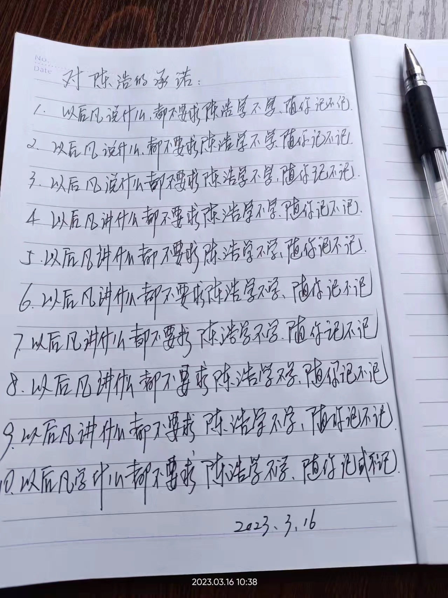

# 爸爸要求学

-   群聊的聊天记录 2023/3/15 20:01:21 来自wolai微信助手
    2023/02/13 10:31:41
    昨天和陈浩沟通好了，我说什么都不要求陈浩学的了，随便陈浩记或者不记，学或者不学，就是说以后说什么都行了，不和以前一样，应该，学习...不能进，反正讲什么不要求陈浩记或者不记的了！
    2023/03/10 11:06:15
    我们己沟通好了的：全部交谈、交流均不要求学习、关注的了。
    2023/03/10 11:07:26
    你己大学毕业，也出来工作几年了，很多知识比我高了，应该我向你学习了！
    2023/03/10 11:08:22
    我们以前也沟通好了很多次，不过这几年看来，你观察到我心情好的时候就又重新要求学了
    2023/03/10 11:09:57
    都不要求学习、关注了。就是随便说说而已，你己长大了，全部你自己抓主意！
    2023/03/10 11:10:31
    这几年看来，每当我叫你别要求的时候，你就说几句“很多知识比爸爸高了，爸爸向陈浩学习”这种好话。等这阵风过了以后，你又重新要求了
    2023/03/10 11:11:33
    你以前也说过很多次“要求学只是随便说说”，可是每隔一段时间你又改口说：“大学生应该知道，这是常识而不是术业有专攻”
    2023/03/10 11:19:13
    以后都不要求了！
    2023/03/10 11:20:23
    什么该懂，什么该学，就自己掌握吧，不会再要求你什么了哈
    2023/03/10 11:20:34
    你以前也说过10次“以后都不要求了”，可是2月13日去返增城的车途中，你还在要求
    2023/03/10 11:21:38
    我希望这次是真真正正的“不要求”，而不是权宜之计——等我以后心情好、找机会再次要求
    2023/03/10 11:23:10
    如果爸爸真的是“随便说说而已”，这个话题就不会拖3年都没说完了。
    我觉得爸爸内心就是很想让我学历史地理政治体育汽车，但又不想摆上台面去要求；只敢暗示，不敢明说。
    2023/03/10 11:29:59
    扬弃：意思是別人说的，有用的就吸收，没用的就抛弃！
    2023/03/10 11:30:38
    是，那就抛弃历史地理政治体育汽车
    2023/03/10 11:31:55
    我来梳理一下咱俩聊这个话题的常规套路：
    1\. 爸爸说：历史、地理、政治、体育、汽车应该学、记一下
    2\. 我说：我有更重要的东西要学，不学这个
    3\. 爸爸说：不用专门花时间去学
    4\. 我说：不用专门花时间去学就是不用学嘛
    5\. 爸爸说：我的意思是能顺带学会就不用专门花时间，你不能从日常关注中顺带学会，那就需要专门花时间
    6\. 我说：那花太多精力了
    7\. 爸爸说：我曾经因为不知道一个信息被同事取笑
    8\. 我说：不知道某信息是很正常的，闻道有先后，术业有专攻
    9\. 爸爸说：但这是常识，不是术业有专攻
    10\. 我说：常识也是各人认为的，你可能认为历史地理政治体育汽车是常识，我认为其他东西是常识
-   群聊的聊天记录 2023/3/15 20:03:50 来自wolai微信助手
    2023/03/15 17:12:21
    换雨括器是很简单，不过5年换一次，每次100元，这点小钱就给别人赚吧
    2023/03/15 17:15:13
    在修水龙头、电灯这种事情也差不多：不是样样都要亲历亲为，有时即使让别人多赚点，只要是偶尔支出的小钱，就让别人赚点也没问题。不是说修水龙头、电灯、换雨刮这所有事情都要把便宜占尽的。
    2023/03/15 17:18:29
    爸爸以前修个灯泡修个水龙头就会提起：“陈浩以前说没必要学，现在看来学了是不是有用。”
    作用肯定是有的，只是分大和小；每个人专心学自己的主业就行了，修水龙头、电灯、换雨刮这种小钱就给别人赚吧。
    爸爸，你说对吗？
    2023/03/15 17:20:23
    自己懂，懒得动手，让别人赚点小钱也行。如果自己不懂，怕别人就会说大价钱了啊
    2023/03/15 17:20:54
    例如雨刮器，自己不懂也不会被骗3倍300元吧。
    2023/03/15 17:21:22
    只要是小钱，不懂的时候被别人说大一点假钱也是可以接受的。
    2023/03/15 17:21:43
    不是说生活中的方方面面都怕别人说大价钱的
    2023/03/15 17:23:18
    不在同一频道上，又或者现在年轻人都这样的吧！
    2023/03/15 17:23:46
    要是样样都怕被别人说大价钱，那就缺乏信任了
    2023/03/15 17:24:23
    几千几万的事情是要小心行事，别被说大价钱。换雨刮器这种5年1次每次100的就相信别人就行了
    2023/03/15 17:26:09
    爸爸能不能理解：“现在年轻人都这样”？
    2023/03/15 17:27:52
    也只是估计，不大理解，换灯泡那么简单，要是不懂，临时要去找人，真的没那么方便的啊
    2023/03/15 17:29:04
    我能理解你觉得简单，你为了方便而自己学。
    但我希望你也能理解：“我觉得不简单，我不想仅为了方便而多学这样东西”
-   3dbbbfd741bcbdeee637d2e79f2e169c.jpg 2023/3/16 10:40:49 来自wolai微信助手

    
